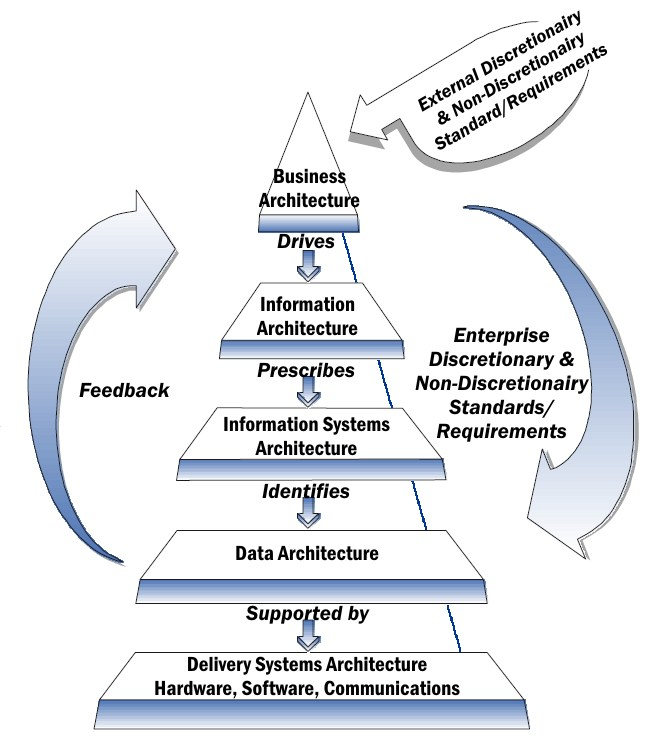

M. Sc. Liliana Millán Núñez liliana.millan@itam.mx

Enero 2020

## Introducción

### Agenda

+ Arquitectura empresarial
+ Arquitectura de productos de datos
+ Ejemplos

#### Arquitectura empresarial

La arquitectura empresarial permite identificar los procesos de negocio existentes
para que las decisiones de compra o construcción de tecnología -normalmente software- correspondan a los mismos.

Existen muchos *frameworks* de arquitectura empresarial: TOGAF, MODAF, EAF. Cada uno tiene sus peculiaridades, en genera definen la arquitectura empresarial en 5 dimensiones (de *top* a *bottom*):

1. Arquitectura de Negocios o Procesos: **Dirige** la información que la empresa puede producir o generar.
2. Arquitectura de Información: **Prescriben** las aplicaciones o sistemas que deben existir en la organización para dar soporte a la información que se produce.
3. Arquitectura de Aplicaciones o Sistemas: **Identifican** la arquitectura de datos que debemos tener.
4. Arquitectura de Datos: **Soportada** por la tecnología que la empresa decida comprar o desarrollar.
5. Arquitectura Tecnológica

 
Fuente: [Mckinsey Enterprise Architecture View](https://enterprisearchitectview.wordpress.com/tag/mckinsey-7s/)

### Arquitectura de productos de datos

#### Productos de datos

 ¿Cuál es el típico *pipeline* para hacer un modelo de *machine learning*?
 
 

Un producto de datos a.k.a. *intelligent system* tiene al menos un componente *machine learning* o modelo (bayesiano, PGM, etc.) y nos permite conectarlo con el usuario para alcanzar los objetivos para los que el modelo -inteligencia- fue creado. Además, este  sistema debe evolucionar y mejorar con el tiempo sobretodo a través del *feedback* generado a través de la interacción que los usuarios tienen con él.

¿Por qué es un sistema?

Existen varios componentes que requieren de una gestión adecuada para que todo funcione correctamente. Por ejemplo, necesitamos ingestar datos con cierta frecuencia, limpiarlos y acomodarlos de cierta manera para que puedan ser ocupados como nuestro modelo(s) los necesita, luego necesitamos generar una predicción y luego emitir esa recomendación hacia alguien o algo que permita realizar una acción adecuada.

Para que un sistema inteligente sea exitoso requiere de 5 elementos:

1. Un objetivo de importancia (*meaningful*): Una razón de existir, esta razón debe ser de importancia para sus usuarios. Recuerda que las propiedades de un buen objetivo son: es medible, alcanzable y comunicable para el equipo que lo va a implementar y para los que lo van a financiar!.
2. Una experiencia inteligente: La predicción generada -inteligencia- deberá ser presentada a los usuarios de alguna forma para que el usuario haga lo requerido dada la predicción. Normalmente esta experiencia está asociada a un dashboard o interfaz.
3. La implementación de la inteligencia: La implementación incluye todo lo que se requiera para ejecutar la inteligencia, moverla, escalarla, administrarla, recolectar métricas de su uso y funcionamiento.
4. Creación de inteligencia: La inteligencia puede venir de diferentes formas, desde simples heurísticas hasta modelos complejos de *machine learning*. La inteligencia se refiere a la parte lógica del sistema.  
5. Orquestación: Un sistema inteligente está vivo, y por lo tanto debemos asegurarnos que todas sus partes sigan balanceados para cumplir con sus objetivos. Es responsable de monitorear los objetivos, inspeccionar y modificar la interacción en caso de ser necesario, actualizar la inteligencia, hacer *override* de la inteligencia si así se requiere. También tiene que lidiar con el manejo de los errores, controlar el riesgo y no permitir el abuso.

En general:

La **inteligencia** es la parte lógica del sistema, la que toma las decisiones sobre qué es lo correcto de hacer y cuando, la **implementación** corresponde a todos los servicios, sistemas *back-end* y *front-end* como interfaz con el usuario para hacerle llegar la salida de la inteligencia, y la **orquestación** es la administración del sistema a través de su ciclo de vida incluyendo el manejo de errores.

Un producto de datos eficiente balancea estos 5 componentes y además toma en consideración cómo este producto puede ser ocupado de forma inadecuada por otro humano con anticipación.

El capítulo 2, 5 y 20 del libro de texto tiene mucho más información al respecto.

En un sistema inteligente o producto de datos el *pipeline* se debe ver así:

 
Fuente: [Components of an AI-Enabled System](https://ckaestne.github.io/seai/slides/02_components/components.html#/4/4)

#### Ejemplos

+ Sistema de recomendación de Netflix
  + ¿Cuál es el objetivo?
  + ¿Cuál es la experiencia inteligente?
  + ¿Cuál es la implementación de la inteligencia?
  + ¿Cuál es la orquestación?

+ Buscador de Google (*Information Retrieval*)
  + ¿Cuál es el objetivo?
  + ¿Cuál es la experiencia inteligente?
  + ¿Cuál es la implementación de la inteligencia?
  + ¿Cuál es la orquestación?

+ Prevención de fraude Banorte

 

  + ¿Cuál es el objetivo?
  + ¿Cuál es la experiencia inteligente?
  + ¿Cuál es la implementación de la inteligencia?
  + ¿Cuál es la orquestación?

+ UberEats: Predicción de tiempo de entrega
  + ¿Cuál es el objetivo?
  + ¿Cuál es la experiencia inteligente?
  + ¿Cuál es la implementación de la inteligencia?
  + ¿Cuál es la orquestación?
