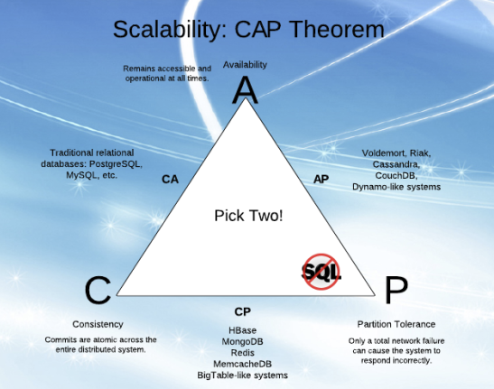
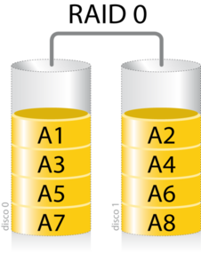
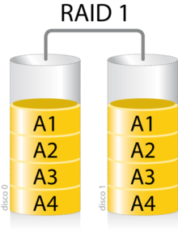
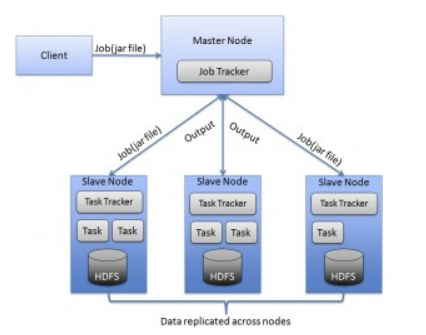
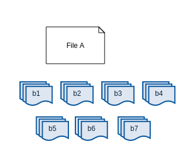
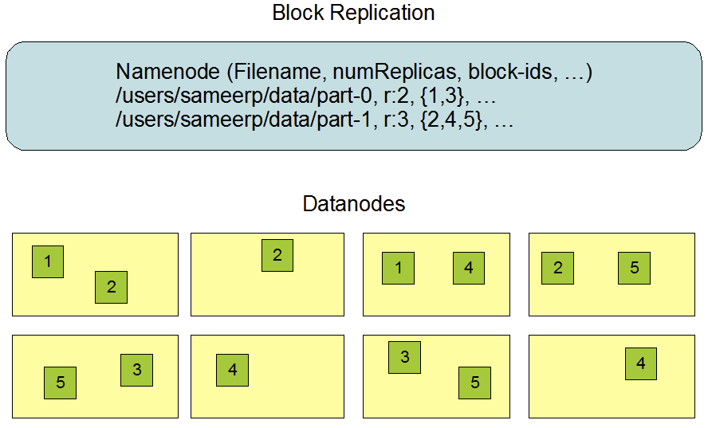
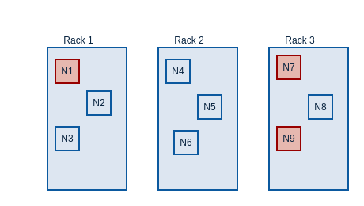
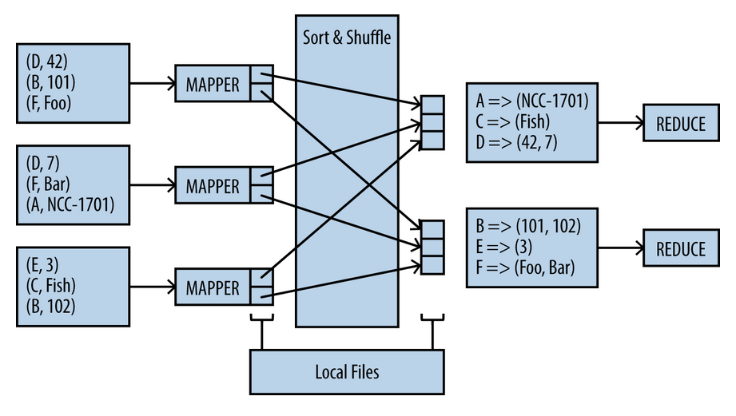
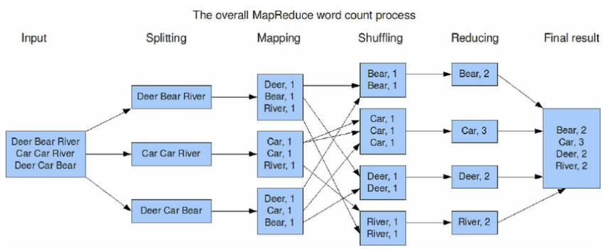

<br>

### Cómputo distribuido

M. Sc. Liliana Millán liliana.millan@itam.mx

Enero 2021

### Agenda

+ Conceptos de cómputo distribuido
  + Escalamiento vertical
  + Escalamiento horizontal  
  + Teorema CAP
  + HDFS
  + Diseño de esquemas en HDFS
  + MapReduce


### Contexto

El procesamiento de grandes escalas de datos está basado en avances computacionales que se han dado en las últimas décadas. Dos de los más importantes son:

1.  Distribución de datos para procesamiento en paralelo
2.  Hardware especializado para procesar en paralelo (GPUs)

Además, se ha modificado la forma en la que "optimizamos" el uso de los recursos computacionales permitiéndonos hacer 2 tipos de escalamiento:

1.  **Escalamiento vertical:** Agregar poder de cómputo al mismo dispositivo. Por ejemplo, cuando le agregas más memoria a tu laptop, así los servidores con memoria, número de cores, capacidad de disco duro, tipo de disco duro, etc.
2.  **Escalamiento horizonal:** Agregar más computadoras para aumentar la capacidad de procesamiento en conjunto. Cuando juntamos varias computadoras decimos que forman un *cluster* donde cada computadora es un **nodo**. El *cluster* puede ser físico, por ejemplo, si hacemos que todas las computadoras de este salón se comuniquen y compartan su poder de cómputo; o en la nube -eso de todas maneras es físico!- en donde las máquinas no son "nuestras", solo las ocupamos por el tiempo necesario y con las características necesarias.

No sería posible tener escalamiento horizontal, sin poder tener formas de distribuir datos y procesar en paralelo.


**Teorema CAP**

En un sistema de computo distribuido no se pueden cumplir más de 2 de las siguientes características simultáneamente\*:

-   **Consistencia:** (Consistency) Todos los nodos ven la misma información al mismo tiempo
-   **Disponibilidad:** (Availability) Garantía de confirmar que la petición hecha a cada nodo fue resuelta, aunque ésta no haya sido satisfactoria
-   **Tolerancia a la partición:** (Partition tolerance) Si algun(os) nodo(s) en el *cluster fallan*, el sistema seguirá funcionando

Estas hablidades se aplican a sistemas de base de datos distribuidos, por ejemplo: Cassandra, MongoDB, etc.


<br>

Es importante aclarar que este teorema aplica **temporalmente** en bases de datos distribuidas -a veces mal llamadas NoSQL- el teorema se cumple temporalmente, solo mientras se realiza la replicación en todos los nodos.

En los sistemas distribuidos la A se logra replicando los datos entre todas las máquinas que forman parte del cluster, la C se logra actualizando varios nodos antes de permitir más lecturas y la P se refiere a que si hay una falla en alguna parte del sistema el sistema sigue procesando correctamente. Si hay un *delay* entonces es cuando tenemos que escoger entre la A y la C temporlamente:

-   En sistemas en donde durante el *particionamiento temporal* se permite leer datos de los nodos antes de actualizarlos se privilegia la A
-   En sistemas en donde durante el *particionamiento temporal* se actualizan los nodos antes de permitir la lectura se privilegia la C

### Un poco de historia de Hadoop

**[Doug Cutting](https://en.wikipedia.org/wiki/Doug_Cutting)** 1997

[Lucene](http://lucene.apache.org/) → [Apache Software Foundation](https://www.apache.org/) → [Apache Nutch](http://nutch.apache.org/) → [HDFS](https://hadoop.apache.org/docs/current1/hdfs_design.html) → [MapReduce](https://hadoop.apache.org/docs/r1.2.1/mapred_tutorial.html) → [Hadoop](https://hadoop.apache.org/)

-   Lucene, motor de búsqueda de texto a partir del indexado de texto. 3 meses.
-   Convertirlo en *open source* para que lo ocuparan más personas.
-   Apache lo adopta.
-   Ya se indexa texto ... ahora conquistaremos el mundo: indexado de **toda** la web, enter [Mike Cafarella](https://en.wikipedia.org/wiki/Mike_Cafarella) → Nutch: *Open source web crawler*.
-   Nutch + Lucene.
-   Nutch: 1 máquina, 1 solo core, 1 GB RAM, RAID -*Redundant Array of Independent Disks* (1987) -un sistema de administración de datos que utiliza múltiples unidades de disco duro- nivel 1 en 8 discos duros (1 TB) → 100 páginas por segundo.
    -   Artículo ["A Case for Redundant Arrays of Inexpensive Disks (RAID)"](https://www.cs.cmu.edu/~garth/RAIDpaper/Patterson88.pdf).
    -   IBM 1977.
    -   Un arreglo de discos barato podía superar el desempeño del mejor disco en la época.
    -   RAID: Poner los mismos datos en diferentes discos permitiendo operaciones I/O que se puedan intersectar en una forma balanceada.
    -   Ante el OS aparecen como un solo disco.
    -   6 niveles: 0 a 5 -cual computólogos :), nos gusta iniciar con índice en 0-:
        -   0: Sin redundancia pero con *[striping](https://searchstorage.techtarget.com/definition/RAID-0-disk-striping)*. Los datos se escriben en 2 o más discos equitativamente (ocupan el mismo espacio).
        -   1: Mirroring, 2 discos.
        -   2: Ya no se usa.
        -   ...


<br>
Fuente: [Wikipedia RAID](https://es.wikipedia.org/wiki/RAID)


<br>
Fuente: [Wikipedia RAID](https://es.wikipedia.org/wiki/RAID)

-   Código hecho para vivir en 1 sola máquina, limitado a **100 millones de páginas indexadas** → no era suficiente.
-   Pongámos 3 máquinas más -¡¡un *cluster*!!- PERO ... la administración de pasar datos entre las máquinas y administrar el espacio lo tenían que hacer manual → esto no va a escalar chavos!, el aumentar el \# de máquinas aumentaba exponencialmente la complejidad de su administración (-’๏\_๏’-).
-   Enter **HDFS** → parece que estos muchachos estaban muy aburridos en la vida ...
    -   Se requería de un sistema de almacenaje distribuido que cumpliera con las siguientes características:
        -   sin esquema -*schemaless*- en estructura y tipos de datos.
        -   durable.
        -   capaz de aguantar fallas de algún compontente físico.
        -   rebalanceo automático.
-   Octubre 2003, Google publica su paper: [*Google File System*](https://ai.google/research/pubs/pub51).
-   Construyen lo descrito en el paper en Java → les toma todo 2004, se crea NDFS -*Nutch Distributed File System*-.
-   NDFS agregaba una capa que abstrae la complejidad de administrar los *nuances* del almacenaje de datos distribuido.
-   Los problemas de durabilidad y tolerancia a fallos se resolvieron partiendo archivos en *chunks* de 64MB guardando cada uno en 3 nodos diferentes ← regresaremos a este punto.
-   Habiendo arreglado todo lo anterior se concentraron ahora en encontrar un algoritmo que fuera compatible con la filosofía de lo ya desarrollado en el NDFS, por lo que se requería que el algoritmo aplicara paralelismo, escalable linealmente (casi) es decir, 8 máquinas corriendo un algoritmo que fuera paralelizable tendrían que ser 2 veces más rápido que 4 máquinas (sin paralelización).
    -   La idea del algoritmo era que de alguna forma se pudieran enviar pedazos de un programa a todos los nodos en un *cluster*, procesarlos por separado, recolectar las salidas y juntarlos para obtener un resultados final. Enter *MapReduce*.
    -   Google al rescate de nuevo publica en diciembre de 2004 ["MapReduce: Simplified Data Processing on Large Clusters"](https://ai.google/research/pubs/pub62)
-   Durante 2005 se ponen a chambear en integrar MapReduce a Nutch.
-   Febrero 2006 nace Hadoop integrango Nutch, HDFS y MapReduce bajo el apoyo de Apache.
-   Al mismo tiempo el equipo de Yahoo! es "obligado" a pasar su ya eficiente buscador hecho en C++ a ocupar la implementación de Google de MapReduce *open source* -a.k.a. MapReduce de Hadoop, ergo Hadoop-, el prinicipal engineer de Yahoo! se niega -¿cómo puede ser posible que quieran pasar del eficiente C++ al ineficiente Java? su pregunta principal... :/- y sus jefes contratan a Cutting para que implemente su buscador ocupando Hadoop ... pum. → Esta es la decisión que salva a Yahoo!.
-   Para 2007 compañías como Facebook, LindekIn, Twitter ocupaban Hadoop y contribuyeron con *frameworks* y herramientas al ecosistema *open source*. Yahoo! ya cuenta con 1,000 nodos en su Hadoop *cluster*.
-   Para 2008 Hadoop deja de ser un subproyecto de Lucene para convertirse en uno de los top en Apache y siendo el paraguas para muchos subproyectos como HBase, ZooKeeper, Pig (contribución de Yahoo!), Hive (contribución de Facebook)
-   2008 nace Cloudera fundado por alguien de BerkeleyDB, Google, Facebook y Yahoo!.
-   2009 Amazon provee servicio de MapReduce en su producto ElasticMapReduce. Cutting se mueve de Yahoo! a Clouderra como *Chief Architect*.
-   2010 la demanda por ingenieros en Hadoop (de datos) crece considerablemente.
-   2011 la gente que quedó en Yahoo! abre su propia empresa Hortonworks.
-   2012 el *cluster* de Hadoop llega a 42,000 nodos.

→ Para leer en detalle sobre las configuraciones de los RAIDS y sus detalles puedes ir [aquí](https://searchstorage.techtarget.com/definition/RAID)

Acá una [infografía](https://unpocodejava.com/2016/01/23/infografia-historia-de-hadoop/) de la historia de Hadoop MUY resumida


### HDFS

*Hadoop Distributed File System*. Sistema de almacenaje de archivos de forma distribuida, es el punto de entrada al ecosistema Hadoop pues es donde almacenamos los datos que queremos procesar en múltiples archivos. Cuando se carga a HDFS un set de datos, éste es dividido en múltiples bloques que serán almacenados de forma distribuida replicándose al menos en **3 nodos** que forman parte del *cluster*.

**Características:**

-   Tolerancia a fallas de HW.
-   Alta disponibilidad.
-   Replicación.
-   Escalabilidad.
-   Almacenamiento distribuido.
-   Está diseñado para procesamiento en *batch* **no** para el uso interactivo de usuarios → no está diseñado para *streaming*!.
-   Tiene un modelo de acceso a archivos de escribir una vez y leer múltiples veces. Esta propiedad implica que **no** se puede agregar datos a un archivo una vez que es creado, escrito y cerrado.
-   Está diseñado para ser portado entre plataformas diferentes de manera sencilla.

**Fact:** Uno de los principios fundamentales en el procesamiento de datos a gran escala es el concepto *"code moving to data rather than data to code"*. Cuando una aplicación solicita hacer algún procesamiento, éste es más eficiente si sucede “cerca” de donde están los datos a los que se tienen que procesar -sobretodo si los datos son de gran escala!-. HDFS provee interfaces para que la aplicación se muevan cerca de donde están los datos que se requieren procesar.

#### Arquitectura

HDFS tiene una arquitectura maestro/esclavo con los siguientes elementos:

1.  **Name Node:** El servidor maestro que administra el sistema de archivos y regula el acceso de los clientes a los archivos.

-   Tiene la *metadata*, la información de cómo los datos fueron divididos -en qué *data nodes* se encuentran- por lo que puede recrear todo el set de datos.
-   Realiza operaciones de apertura, cierre y renombramiento de archivos y directorios.
-   Determina el mapeo de los bloques a los *data nodes* -*JobTracker*-.

2.  **Data Nodes:** Normalmente 1 por cada nodo, administran lo que está guardado en ellos.

-   Responsables de atender las peticiones de escritura y lectura de los clientes del sistema de archivos.
-   Llevan a cabo la creación de bloques, borrado y replicación bajo instrucción del *Name Node*.


<br>

Fuente: <http://blog.raremile.com/hadoop-demystified/>

Ambos tipos de nodo están diseñados para correr en máquinas que usualmente tienen Linux como sistema operativo, y debido a que Hadoop está hecho en Java las máquinas que forman parte del *cluster* con Hadoop requieren de tener Java.

Un despliegue típico de una arquitectura de Hadoop ocupa un nodo para el *Name Node* mientras que el resto de las máquinas -nodos- en el *cluster* corren 1 instancia del programa *Data Node*.

**File system namespace**

-   HDFS puede trabajar con una organización de archivos jerárquica tradicional -aunque físicamente no se guardan de esta manera-.
-   Como en los sistemas de archivos tradicionales en HDFS se pueden crear, borrar, renombrar y mover archivos.
-   Se puede utilizar *user quotas* y permisos de acceso.
-   No acepta los [*soft* o *hard* links](https://www.ostechnix.com/explaining-soft-link-and-hard-link-in-linux-with-examples/).

El *Name Node* es el responsable de mantener este *file system namespace*, cualquier cambio realizado en el sistema de archivos o en sus propiedades queda almacenado en el *Name Node*. El *Name node* también es responsable de administrar el número de réplicas que se generar por archivo -*replication factor*-.

**Data Replication**

-   HDFS almacena cada archivo como una sequencia de bloques, estos bloques son replicados en el *cluster* para tener tolerancia a fallas -físicas-. El tamaño de los bloques y el número de réplicas son configurables por archivo -aunque se puede establecer una configuración de ambos por *default*-.

 <br>

-   **Todos** los bloques de un archivo excepto el último son del mismo tamaño ... ¿por qué?. El tamaño por *default* es de **64MB** por bloque, pero el tamaño 'óptimo' depende de la naturaleza del *dataset* y de cómo se utilizarán los datos en la aplicación
-   Se puede especificar el número de réplicas de un archivo -normalmente se pone mínimo 3- ... ¿por qué?
-   El factor de replicación se puede especificar en el momento de la creación del archivo y se puede cambiar después. Los archivos en HDFS se escriben **una vez** (excepto por *appends* y *truncates*) y tienen estrictamente un solo *writer* por vez
-   El *Name Node* es el que toma las decisiones relacionadas a la replicación de los bloques y periódicamente recibe un *heartbeat* y un reporte de los bloques -*Blockreport*- de cada *Data Node* en el *cluster*. Al recibir el *heartbeat* el *Name Node* se asegura que ese nodo está "vivo" y que está funcionando correctamente, y el *Blockreport* contiene la lista de todos los bloques contenidos por *Data Node*

 Fuente: <https://hadoop.apache.org/docs/stable/hadoop-project-dist/hadoop-hdfs/HdfsDesign.html#Data_Replication>

**Anatomía de la replicación**

-   *Replica placement*

Dónde se ponen las réplicas de cada bloque es un tema muy importante porque afecta el desempeño y confiabilidad -*reliability*- de HDFS. Optimizar el lugar en donde poner cada réplica requiere de mucho *tuneo* y experiencia! ... → acérquense a su ingeniero de datos de cabecera :P.

Si el *cluster* de Hadoop es tan grande que se requiere de ocupar *racks*, el protocolo de replicación más simple consiste en poner cada réplica en diferentes *racks* esto evitará que perdamos datos si un *rack* completo se cae. Este protocolo balancea la distribución de las réplicas en el *cluster* pero incrementa el costo de escritura ya que se requieren transferir bloques a varios *racks*.

Cuándo se deja la réplica de 3 -con *racks*- se deja 1 réplica en la máquina local -si el *writer* está en el *Data Node*- o en cualquier nodo en otro caso, otra réplica en un nodo en otro *rack*, y la última en un nodo diferente en el mismo *rack* del anterior.



Si el factor de replicación es mayor a 3, el *placement* de cada réplica a partir de la 4 se determina de forma aleatoria cuidando que el número de réplicas por *rack* se encuentre por debajo de su límite máximo: $(replicas -1)/(racks + 2)$.

**NOTA:** Debido a que el *Name Node* no permite que haya más de una réplica de un mismo bloque en un mismo *Data Node* el máximo número de réplicas corresponde al número de *Data Nodes* en el *cluster* de hadoop.

-   *Replica selection*

Con el propósito de minimizar la latencia de lectura y el ancho de banda de red ocupado, HDFS siempre busca satisfacer una petición de lectura con la réplica del bloque que contenga los datos más cercana al que solicitó la petición. Si existe una réplica en el mismo *rack* donde se encuentra el nodo *reader* entonces se escogerá esta réplica de entre las demás disponibles. Si el cluster incluye múltiples *data centers* entonces escogerá la réplica que se encuentre en el *data center* local antes que el remoto pues es más cercano al nodo lector.

-   *Safemode*

Cuando se levanta el cluster de Hadoop el *Name Node* entra en un estado especial llamado *Safemode*, en este estado el *Name Node* no genera réplicas de los datos, solo puede recibir *heartbeats* y *blockreports* de los *Data Node* del cluster.

El *Blockreport* contiene la lista de los *data blocks* que contiene, cada bloque tiene especificado el número mínimo de réplicas que requiere. Se considera que un bloque está replicado correctamente cuando su mínimo número de réplicas ha sido notificado al *Name Node*. Después de que se cumple un % -configurable- de notificaciónes de réplica de un bloque al *Name Node* y después de 30 segundos el *Name Node* sale de este estado *Safemode*, luego determina cuáles bloques no cumplen con el mínimo % de replicación para iniciar su replicación a otros *Data Node*.

[Socrative Room: LILIANA2205](http://www.socrative.com/login/student)

#### Schema design

Una de las primeras cosas que hay que definir para ocupar HDFS es el diseño del esquema -la jerarquía y grupos que ocuparemos en el sistema de archivos-. Un diseño simple de directorios puede ser:

    |- user
    |- etl
    |- tmp
    |- data
    |- app
    |- metadata

-   `/user/<username>`

En este directorio se encuentran los archivos/datos de configuración específicos a un usuario. Los archivos que están aquí **no** son ocupados como parte del proceso de negocio y son únicamente ocupados por el dueño de los mismos -por eso el *username*-. Por ejemplo: Archivos con los que se está jugando en un pequeño proceso y con los que queremos primero experimentar, o salidas específicas a este usuario.

-   `/etl`

En este directorio se encuentran los datos que están en alguno de los procesos de algún *etl*. Se recomienda tener una organización dentro de esta carpeta por grupo o área de la empresa que tenga algún proceso de *etl*, la aplicación asociada y el proceso que se realiza `etl/<group>/<application>/<process>`.

    |- etl
    |--- group
    |----- application
    |------- process

También se recomienda agregar al final un subdirectorio `bad` para dejar en este directorio aquellas observaciones que no pudieron ser procesadas correctamente -recuerda que no queremos perderlas...-.

Por ejemplo:

    |- etl
    |--- bi
    |----- clickstream
    |------- deduplication

-   `/tmp`

En este directorio se guardan **temporalmente** archivos que pueden ser salidas/entradas de otros procesos. Se recomienda que esta carpeta se borre automáticamente por algún *script* después de terminar el(los) proceso(s) adecuados para no tener basura acumulada que quita espacio.

-   `/data`

En este directorio se guardan los *datasets* que ya han sido procesados y que se comparten en toda la organización. Debido a que estos datasets ya están limpios y varios tienen acceso se recomienda solo dar permisos de lectura -no faltará el que la cajetee y borre/actualice los datos sin querer-. La única forma de escribir a este directorio debe ser a través de algún proceso automatizado -después del etl(s) normalmente- **auditado**.

Se debe agregar un directorio por cada *dataset* para identificar de qué va ese *dataset*. Por ejemplo: Si tenemos el *dataset* de ecobici y de calidad del aire de CDMX -supongamos que somos una empresa de análisis de datos- tendríamos la siguiente estructura:

    |- data
    |--- cdmx
    |----- ecobici
    |----- calidad_aire

-   `/app`

En este directorio se guarda todo lo que requiere una aplicación de Hadoop para correr: `jars`, *workflow definitions*, *UDF*s -User Defined Functions, Hive-, archivos HQL -Hive-, etc.

Sigue la misma estructura propuesta que en la carpeta `etl` y además se agrega la versión/tag y/o artefacto que estamos ocupando:

    |- app
    |--- group
    |----- application
    |------- version

-   `/metadata`

Este directorio guarda la *metadata* generada por algún proceso -datos de los datos- ¿qué dato de los datos se te ocurre guardar?

Normalmente este directorio tendrá permisos de lectura para procesos del ETL y de escritura para los procesos que ingestan datos a Hadoop -Sqoop-.

Dentro de este directorio se debe guardar el nombre del *dataset* al que pertenece la *metadata*, también se puede agregar el proceso que "genera" la *metadata*. Por ejemplo:

    |- metadata
    |--- ecobici

#### Estrategias de almacenamiento

El diseño del esquema resuelve el punto de la organización de archivos, pero no resuelve el cómo guardar eficientemente los archivos en HDFS -el formato con el que serán almacenados-.

Hay 3 estrategias para almacenar los datos: *Partitioning, bucketing, denormalizing*

1.  **Partitioning**

En las bases de datos tradicionales -SQL relacional-, para hacer una búsqueda más rápida se generan índices sobre los datos, estos índices se crean -normalmente- al momento de ir "llenando" la tabla de los datos, esto hace que la inserción de los datos sea lenta pero el beneficio viene al momento de hacer *queries*, pues el DBMS no necesita hacer un *full table scan* para encontrar los registros requeridos. Esto no sucede en HDFS pues no hay indexado de datos -¡parte del por qué la ingestión es mucho más rápida que en una BD tradicional para grandes conjuntos de datos!- ... ¿cómo resolvemos el problema de tener que hacer un *full table scan* para encontrar ciertos registros?

La estrategia de partición requiere de hacer unas modificaciones a la forma en la que organizamos los datos en HDFS. Para hacer una partición ocupamos el `=` dentro del nombre del directorio al que queremos particionar -piénsalo como hacer índices de forma manual-. Por ejemplo: con los datos de ecobici tenemos la intuición de que será mejor separarlos por día ya que es muy seguro que queramos hacer preguntas con respecto a comportamientos por día... para hacer esta partición agregaríamos al directorio donde guardemos los datos de Ecobici:

```
    |- data
    |-- ecobici
    |---- date=20170101
    |------ datos_1.csv
    |------ datos_2.csv
```

O mejor aún

```
    |- data
    |-- ecobici
    |---- year=2017
    |------ month=01
    |-------- day=01
    |----------- datos_1.csv
    |----------- datos_2.csv
```

Puedes pensar que la segunda opción es demasiado específica, pero en mi experiencia funciona mucho mejor ser más específico -de nuevo es como tener un índice por año, uno para mes, uno para día- y es más eficiente para recuperar datos → recuerda que estamos trabajando con datos de gran escala, cada optimización por más pequeña que sea es un beneficio enorme en todo el proceso :).

Esta estrategia es "entendida" por las tecnologías que se ocupan en Hadoop para poder hacer *queries* sobre los datos: Pig, Hive, Impala, HCatalog.

1.  **Bucketing**

La estrategia de particionamiento funciona cuando es posible particionar el set de datos de manera que muchos archivos "caen" en la partición, esto sucede cuando los datos se organizan por fechas, o bien cuando conocemos muy bien nuestros datos; pero si los datos no son organizados por fechas... o no los conocemos con detalle, la estrategia de *partitioning* no es una buena opción. Por ejemplo: Supongamos que queremos organizar los datos de Ecobici -porque eventualmente preguntaremos de esa manera- por usuario de ecobici... habrá usuarios que casi no ocupan Ecobici, mientras que hay otros muy comprometidos con el medio ambiente que lo ocupan todos los días... u otros que no les queda de otra :P ... en estos casos en los que es posible que haya **pocos archivos** por partición se ocupa la estrategía *bucketing*.

El *bucketing* funciona "hasheando" los valores de una columna -`user_id`- en un número de *buckets* predeterminado por "alguien" -el número de *buckets* debe ser mucho menor que el número diferente de registros que exista en la columna hasheada -un buen tamaño de cubeta puede ser de algunos múltiplos del tamaño del bloque en HDFS, esto hará que las cubetas estén bien distribuidas-. En cada *bucket* habrá diferentes `user_id` particionando la tabla completa.

Para saber en qué bucket debe ir cada registro el hash que se utiliza es el [MurmurHash](https://en.wikipedia.org/wiki/MurmurHash).

Esta estrategia también beneficia el uso de *joins* entre diferentes datos ... ya veremos más adelante que hacer un *join* en *MapReduce* no está tan sencillo, aunque esta operación la podemos hacer desde Pig, Hive, Spark sin necesidad de quebrarnos la cabeza con el MapReduce ;). Cuando los datos se encuentran en *buckets* el *join* se realiza entre suconjuntos de datos más pequeños que una tabla completa, por lo que se reduce significativamente el tiempo de procesamiento → recordemos que al estar trabajando con datos a gran escala cualquier optimización brinda un beneficio al tiempo de procesamiento.

Se recomienda que las tablas que sean muy largas -en SQL tradicional- se guarden en *bucketing* utilizando como llave para hacer el *bucketing* la variable con la que normalmente se le hace *join* a otras tablas (o *wheres*).

1.  **Denormalizing**

Con la estrategia de *bucketing* identificamos que los *join* pueden ser un problema en una arquitectura de Hadoop, pues son muy caros computacionalmente -requieren muchos recursos del *cluster*- y corresponden al conjunto de operaciones más lentas en Hadoop. Una solución para esto es **no tener que hacer joins** y para evitar tener que hacer *joins* tenemos que denormalizar los datos.

En una BD tradicional los datos se guardan en tercera forma normal -3NF- asegurando que no haya redundancia en los datos y resguardando su integridad en las operaciones que se realizan sobre los mismos -actualizaciónes principalmente-. Esta forma de guardar los datos provoca tener que hacer *joins* entre diferentes tablas para encontrar más variables/atributos que necesitamos que formen parte de la respuesta de nuestro *query*. Para evitar hacer estos *joins*, esta estrategia plantea denormalizar los datos -unirlos a una sola tabla que contenga todos los atributos pertenecientes a diferentes tablas. Esto implica hacer el *join* antes de guardar los datos → en el ETL!!! :).

El simil más parecido a lo que estamos haciendo con estas estrategias en BD tradicional operativa son las famosas vistas materializadas...

 Notarás que en Hadoop no nos importa el espacio que ocupen los datos, ni repetirlos para guardarlos en diferentes estrategias de almacenamiento... lo que nos importa es la forma en la que los guardamos para optimizar su lectura y procesamiento en capas más arriba :). Denormalizar en una BD tradicional es un **pecado capital** además de que te tildan de ignorante :/ pero pues en ese mundo operativo tiene todo el sentido del mundo normalizar, en el nuestro **NO!**.


### MapReduce

Es un concepto introducido por primera vez en 2004 en un *paper* publicado por Google [MapReduce: Simplified Data Procesing on Large Clusters](http://static.googleusercontent.com/media/research.google.com/en/us/archive/mapreduce-osdi04.pdf).

MapReduce es un paradigma de programación -un modelo de programación- creado para el procesamiento de grandes cantidades de datos a través de su procesamiento en paralelo en un *cluster*. El algoritmo de procesamiento está compuesto por dos fases: la fase *map* y la fase *reduce*, para ambas fases la entrada y la salida son pares `<llave, valor>`.

1.  Fase *Map*

A los procesos que ejecutan el *map* se les conoce como *mappers* -proceso de Java-, normalmente hay 1 por nodo y se ejecutan en los nodos que tengan los datos sobre los que se quiere hacer el procesamiento -recordemos que en procesamiento distribuido se prefiere mover el proceso a mover los datos por el *cluster* ya que es muy costoso en recursos-

**Características**

-   Los *mappers* procesan entradas únicamente en la estructura `<llave, valor>`.
-   Los *mappers* solo pueden procesar **un** par `<llave, valor>` a la vez.
-   El número de *mappers* en el *cluster* es configurado por el *framework* no por el desarrollador -aunque es posible que el desarrollador ponga un \#-, el \# de *mappers* depende del tamaño del *set* de datos de entrada del *job* y del tamaño de los bloques, 1 bloque por *mapper* → **el \# de *mappers* de un trabajo de MapReduce es igual al número de bloques en el set de datos a procesar**. Por ejemplo: Si tenemos 10TB como entrada y un *block size* de 128MB ¿cuántos *mappers* tenemos?
    -   1 TB = 1,099,511,627,776 bytes
    -   1 MB = 1,048,576 bytes
-   La salida de los *mappers* son pares `<llave, valor>` que son enviados únicamente a los *reducers*.
-   Los *mappers* no se pueden comunicar entre ellos.
-   Los *mappers* no ocupan mucha memoria y el tamaño del *heap* -*heap size*- de la JVM (Java Virtual Machine) es relativamente bajo.
- Un *mapper* requiere de 1 a 1.5 cores para correr por lo que el número de *mappers* que puede haber en un nodo *slave* dependerá del número de cores disponibles en ese nodo *slave*.

2.  Fase *Reduce*

Una vez que el procesamiento de datos se ha hecho en los *mappers*, los datos se pasan a un proceso de *sort* y *shuffle* en donde los datos son ordenados y particionados, una vez que los datos son ordenados y particionados se mandan a los *reducers*. Los procesos de *sort* y *shuffle* forman parte de la fase *reduce* (aunque no suceden físicamente en los *reducers*).

Los *reducers* -también procesos de Java- reciben los datos **ordenados** y particionados, hacen alguna operación(es) sobre ellos -normalmente alguna agregación- y escriben la salida a HDFS o a la opción elegida como sistema de archivos distribuidos.

**Características**

-   Los *reducers* no se pueden comunicar entre ellos, solo con los *mappers*.
-   La salida de los *reducers* como en los *mappers* son pares `<llave, valor>`.
-   Usualmente cada *reducer* tiene un solo flujo de salida -aunque no siempre-.
-   La salida por default es guardada en disco en archivos con un prefijo `part-r-0000` bajo un mismo directorio de HDFS.
-   Los *reducers* normalmente no ocupan mucha memoria y el tamaño del *heap* de la JVM es relativamente bajo.
-   Si la salida del *reducer* requiere procesamiento adicional el data set completo será escrito a disco y vuelto a leer de nuevo :/.
-   El \# de *reducers* se establece a nivel del *cluster*, aunque se puede sobreescribir este valor para ciertos *jobs* cuando se tiene mucha experiencia con los datos a procesar -conocemos el tamaño de los datos y cómo se particionan-.
-   El \# de particiones es igual al \# de *reducers*.
-   Para particionar el set se ocupa una función de *hash*.
- Un *reducer* requiere de 1 a 1.5 cores para correr por lo que el número de *reducers* que puede haber en un nodo *slave* dependerá del número de cores disponibles en ese nodo *slave*.


<br>
Fuente: Libro *Hadoop Application Architectures*

**Desventajas**

MapReduce no es una buena solución para algoritmos iterativos pues tiene las siguientes desventajas:

-   Tiempo de "arranque": Aunque no estemos haciendo nada de procesamiento con MapReduce en el *cluster*, se pierden entre 10 y 30 segundos para iniciar MapReduce.
-   MapReduce escribe constantemente a disco para facilitar el cumplir con la propiedad de tolerancia a fallos → la evolución fue Spark! y por eso se prefiere ocupar Spark ... lo veremos más adelante.

**Recomendaciones**

-   El \# de *mappers* depende del \# total de bloques de los archivos de entrada como lo vimos anteriormente, es posible poner más *mappers* configurando `Configuration.set(MRJobConfig.NUM_MAPS, int)` (en Java).
-   Conforme aumenta el número de *mappers* en un nodo, la ejecución de un *mapper* puede tomar más de un minuto.
-   Incrementar el \# de *reducers* incrementa el balanceo de carga, baja los costos de fallas pero incrementa el uso de recursos del *framework*.
-   Se puede poner el \# de *reducers* en 0 si no es necesario hacer un procesamiento *reduce* → la salida de los *mappers* **no** será ordenada ni particionada (y sería muy extraño).

#### Modelo de programación MapReduce

La inspiración de MapReduce viene de la programación funcional, bajo este modelo de progamación, la entrada es particionada en pequeñas partes, se ejecuta el código del *mapper* en cada parte, luego junta todos los resultados de los *mappers* en uno o más *reducers* que juntan/combinan los resultados para entregar uno final.

-   *Map* corresponde a una función que aplica una función a cada elemento en una lista -[lambda functions](https://docs.python.org/3/tutorial/controlflow.html#lambda-expressions), *list comprehension*, *apply*.
-   *Reduce* corresponde a una función que analiza una estructura de datos recursiva a la que aplica las operaciones definidas para combinarlas y devolver una sola respuesta.

En `dplyr` cuando hacemos un `group_by() %>% summarise()` la parte del `group_by` corresponde al *mapper* y la parte del `summarise` al *reducer*

La forma en la que corremos procesos de MapReduce es a través de un programa escrito en Java (╯°□°)╯︵ ┻━┻ con los siguientes parámetros de entrada:

-   Un método `main` desde donde configuramos un *job* de MapReduce y lo "levantamos"
    -   Establecemos \# de *reducers*.
    -   Configuramos las clases de *mapper* y *reducer*.
    -   Configuramos el particionador (¿Qué tipo de particionador?).
    -   Configuramos otras cosas de Hadoop.
-   Una clase *Mapper*
    -   Toma como entrada tuplas de `<llave, valor>` y escribe tuplas de `<llave, valor>`.

Debido a que la librería de Hadoop de *streaming* implementa estas chivas mencionadas arriba, nos servirá como API para escribir el proceso de MapReduce en otros lenguajes, para ello solo hay que leer de `STDIN` y escribir a `STDOUT` ＼(＾O＾)／. Solo debemos tener en cuenta que esta librería **supone que las tuplas `<llave,valor>` están separadas por un tab `\t`**.

Para correr un job de *streaming* en Hadoop solo debemos indicarle a Hadoop de dónde sacar el `.jar` de *streaming* ... depende de la versión de Hadoop que hayamos instalado pero como nosotros estamos en la 2.7.x, el `.jar` se encuentra en el siguiente directorio: `/usr/local/hadoop/share/hadoop/tools/lib/`

**Ejemplo:** El *Hello world!* de MapReduce es hacer un conteo de palabras de algún texto... juguemos con el *Hello World*.

**Objetivo:** Contar la frecuencia de operación de cada palabra en un texto

-  ¿Cómo diseñamos el conteo de palabras para hacer en modelo de programación MapReduce?

-  ¿Qué harían los *mappers*? ¿Qué harían los *reducers*? (¿más de uno?)


<br>
Fuente: <https://www.researchgate.net/figure/Word-count-program-flow-executed-with-MapReduce-5_270448794>

##### Python

Haremos "trampa" porque no queremos programar en Java ni en *Jython* para poder ejecutar procesos de MapReduce, en lugar de esto ocuparemos la librería de *Hadoop streaming* para poder escribir el código en Python y poder ejecutar el código en Hadoop :P.

En mi máquina tengo "La Ilíada" de Homero en un txt plano que bajé del proyecto [Gutenberg](http://www.gutenberg.org/cache/epub/6130/pg6130.txt).

Empezaremos con algo sencillo, sin pensar en MapReduce cómo contaríamos la frecuencia de aparación por palabra en *plain vanilla* python?.

```
    #!/usr/bin/python

    import sys
    import re

    sums = {}

    for line in sys.stdin:
      line = re.sub('^\W+|\W+$', '', line) #elimina lo que no sea alfanumérico al inicio y fin de la línea
      words = re.split('\W+', line)

      for word in words:
        word = word.lower()
        sums[word] = sums.get(word, 0) + 1

    print(sums)
```

Pasemos esto a *map* y *reduce*.

**Mapper**

```
    #!/usr/bin/python

    import sys
    import re

    for line in sys.stdin:
      line = re.sub('^\W+|\W+$', '', line) #elimina lo que no sean alfanumérico al inicio y fin de la línea
      words = re.split('\W+', line)

      for word in words:
        print(word.lower() + "\t1") #mandamos a la salida la palabra separada por un tab y un 1
```

**Reducer**

Recuerda que al *reducer* le llegan los pares de `<llave,valor>` **ordenados!**

```
    #!/usr/bin/python

    import sys

    previous = None
    sum = 0

    for line in sys.stdin:
      key, value = line.split('\t')
      if key != previous:
          if previous is not None:
            print(previous + '\t' + str(sum))
          previous = key
          sum = 0

      sum += int(value)

    print(previous + '\t' + str(sum))
```

Probemos esto en python sin MapReduce para ver cómo demonios funciona esto ... (`ctr+d` para terminar el stdin)

 Estos scripts se encuentran en la carpeta `scripts`.

Ahora probemos con MapReduce! ๏◡๏

 Necesitarás cambiar la versión del jar dependiendo de la versión de Hadoop!
```
    $bin/hadoop jar /usr/local/hadoop/share/hadoop/tools/lib/hadoop-streaming-2.7.4.jar \
    -input /iliada/input.txt \
    -output /iliada/output \
    -file /home/lmillan/Documents/itam/metodos_gran_escala/datasets/mapper.py \
    -mapper mapper.py \
    -file /home/lmillan/Documents/itam/metodos_gran_escala/datasets/reducer.py \
    -reducer reducer.py
```

 Ir a cluster EMR

### Ejercicios de HDFS en EMR

1. Cargar un archivo a HDFS desde S3

* Ver qué hay en hdfs (debe estar vacío)
```
hdfs dfs -ls
```

* Creamos una carpeta para almacenar los datos

```
hdfs dfs -mkdir flights
```

* Cargar datos en HDFS
```
hdfs dfs -cp s3n://tu-bucket/path/archivo.csv flights/
```

* Revisar que ya se cargaron los datos en HDFS
```
hdfs dfs -ls flights
```

2. Revisar el *report block*
```
hdfs fsck flights/flights.csv -files -blocks
```

3. Revisar los *namenodes*
```
hdfs getconf -namenodes
```

4. Revisar los *datanodes*
```
hdfs dfsadmin -report
```


### Referencias

* [Hadoop](http://hadoop.apache.org/)
* [Comandos de Hdfs](https://hadoop.apache.org/docs/current/hadoop-project-dist/hadoop-hdfs/HDFSCommands.html)
* [HDFS](https://hadoop.apache.org/docs/r1.2.1/hdfs_design.html)
