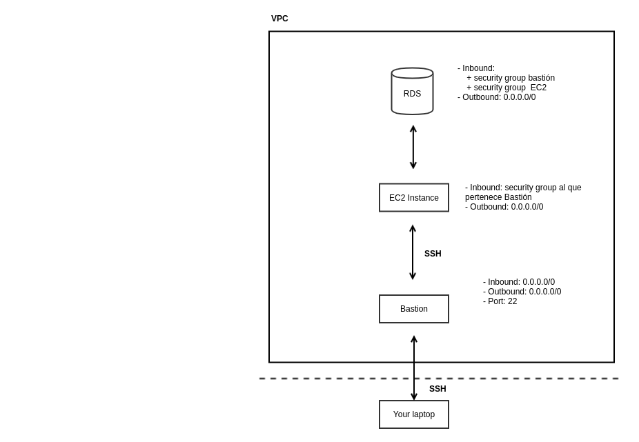

 

### Infraestructura

M. Sc. Liliana Millán Núñez liliana.millan@itam.mx

Febrero 2021

### Agenda

+ Seguridad
  + *Tunneling*
  + SSH, llaves privadas, llaves públicas
+ AWS
  + S3
  + EMR
  + EC2
  + RDS
+ Configuración de tu *cluster*
+ Conceptos de CI/CD

### Seguridad

+ *Tunneling*

Concepto de redes, una forma de comunicación entre dos dispositivos de una forma "segura" a través de usar redes públicas consideras inseguras. Existen diferentes protocolos para poder realizar esta comunicación, uno de los más comunes es SSH (otro son las VPN -*Virtual Private Network*-).

+ SSH: *Secure Shell*

Un tipo particular -protocolo- de *tunneling* a través del cual podemos realizar *logins* y transferir archivos sobre redes no confiables ya que los datos que viajan a través de este tipo de *tunneling*, viajan encriptados. Este es el protocolo que se ocupa para usar los servicios de AWS.

 
Fuente: [SSH.COM](https://www.ssh.com/ssh/tunneling)

Este protocolo utiliza como método de autenticación un par de llaves: privada y pública- para dar acceso a las personas seleccionadas en los dispositivos seleccionados.

La generación de estas llaves está basada en algoritmos de encriptación asimétricos -existen dos llaves-, en particular la de SSH está basada en el algoritmo [RSA](https://www.di-mgt.com.au/rsa_alg.html) que utiliza números primos muy grandes como parte de su *core*.

**Llave pública:**

La llave que compartes con todo el mundo y que no tienes que recordar, solo la envías al administrador de la red que debe ponerla en el servidor de SSH. Aquellos que tienen tu llave pública pueden generar datos encriptados que solo el que tenga la llave privada podrá descifrar.

Una vez que la llave pública está en el servidor de SSH y verifica que es válida y correcta, la pone como una llave autorizada en el archivo *authorized_keys*.

**Llave privada:**

La otra parte de la llave, está **no** se debe compartir con nadie! ni copiar y pasar a otros dispositivos (es mejor un par de llaves por cada dispositivo), el que tiene esta llave es considerado el dueño de la llave pública.

#### SSH Keygen

Para crear este par de llaves necesitarás un programa que te las generes.

+ Linux `ssh-keygen`que ya viene en tu sistema operativo.
+ Mac, también tiene `ssh-keygen`.
+ Windows [PuTTYgen](https://docs.joyent.com/public-cloud/getting-started/ssh-keys/generating-an-ssh-key-manually/manually-generating-your-ssh-key-in-windows)

##### Linux

1. Abre tu terminal, y pon `ssh-keygen`. Esto iniciará la creación de un par de llaves.
2. El programa te pedirá la ruta y nombre del archivo donde quieres guardar la llave. Deja la que tiene por *default*, a menos que ya tengas una llave creada antes: `id_rsa.pub` e `id_rsa`. Puedes cambiarle el nombre sin problema.
3. Te pedirá una `passphrase` para generar la llave, que servirá como semilla aleatoria para poder generar las llaves. **No** se te vaya a olvidar este `passphrase` porque te lo pedirá cuando quieras conectarte a tu infraestructura de AWS.
4. Si todo se generó correctamente te mostrará un *output* "raro" con caracteres y te indicará que ocupó el algoritmo de RSA de 2048 bits utilizando SHA256 -genera un *hash* de 256 bits sin colisiones-.

 Entonces necesitarán tener las llaves públicas de los miembros de sus equipos para que puedan compartir la misma infraestructura, y también la mía para que pueda meterme a verificar su infraestructura.

### AWS

Acrónimo de *Amazon Web Services*, los servicios de infraestructura en la nube de Amazon, que desde hace rato conforma la unidad de negocio más *profitable* de Amazon.

AWS tiene muchos (muchos muchos!) servicios, y sigue siendo la solución de servicios de la nube más utilizada en la industria. Otros proveedores son Microsoft con Azure, Google con *Google Cloud Platform*, IBM con IBM *Cloud Services*.

Nosotros nos concentraremos en algunos servicios que nos ayudarán a levantar un *cluster* con servicios de MapReduce -EMR (*Elastic Map Reduce*)-, y a tener un *cluster* con computadoras pequeñas que nos permitan tener una base de datos relacional -EC2, RDS (Relational Database Service) respectivamente-.

También ocuparemos el servicio de almacentamiento de archivos de AWS, S3 que si bien no está definido como un DFS seguramente por debajo tiene muchas de las cosas de DFS. Para interactuar de manera más sencillas con algunos de estos servicios ocuparemos el CLI (*Command Line Interface*) de AWS que puedes instalar usando  `pip install awscli` en tu ambiente `pyenv` de esta materia.

Si tienes varias cuentas de AWS -tu trabajo y la escuela- puedes crear un archivo `credentials` (sin extensión) para almacenar todos los pares de `aws_access_key_id` y `aws_secret_access_key`. Para crear este archivo necesitas tener instalado `awscli` y poner `aws configure`, este programita te preguntará cuál es tu *access key id*, tu *secret access key*, la región y formato *default*; estos últimos 2 puedes dejarlos vacíos.

 
Fuente: [AWS Configuration basics](https://docs.aws.amazon.com/cli/latest/userguide/cli-configure-quickstart.html)

Esto generará el archivo `credentials` que se encuentra bajo el directorio `~/.aws`.

 Cuando creas tu cuenta de AWS educativa se generan estas llaves de *access key* y *secret access key* de aws.

#### EC2 (Elastic Cloud Computing)

Este servicio de AWS nos permite crear instancias de computadoras con sistemas operativos instalados, y dependiendo de nuestras necesidades podemos escoger entre instancias optimizadas a procesamiento, a almacenamiento, a CPU, a memoria, etc. Debido a todas estas posibles combinaciones hay muchos tipos de instancias disponibles en AWS por lo que te servirá conocer los [tipos de instancia de EC2](https://aws.amazon.com/ec2/instance-types/).

+ VPC *Virtual Private Cloud*: Nos permite aprovisionar un espacio lógico en la nube de AWS para que podamos poner nuestras instancias EC2 a las que solo quienes definamos tengan acceso. Cuando creas una VPC tienes que definir un rango de direcciones IP4 en la forma de un *CIDR block (Classles Inter-Domain Routing)*, por ejemplo: `10.0.0.0/16`. La primera vez que levantas "algo" en AWS se crea una VPC por *default*.

+ *Subnet*: Dentro de la VPC puedes crear un rango de direcciones para poner instancias EC2 específicas. El acceso a estas subredes se determina a través de los *Inbounds* y *Outbounds*.

+ IPs *Inbounds* y *Outbounds*: Las IPs *Inbound* indican las IPs que tienen acceso a una *subnet*, mientras que las *Outbound* indican las IPs hacia las que puede ser enviada la salida, un asterisco \* indica cualquier IP.

+ Redes públicas y privadas: Las redes privadas tienen definidas IPs específicas que tienen acceso a los recursos dentro de ella, una VPC genera una red privada.

+ *Elastic IPs*: Es una IP estática a través de la cual podemos acceder a nuestro VPC sin importar la IP interna a la VPC/Subnets. Esta IP es la misma para nosotros pero por abajo cambia dinámicamente a la instancia que se encuentre "levantada". Este tipo de IP se utiliza para asegurar que sin importar si una instancia está disponible o no, la accesibilidad a nuestra aplicación está asegurada.

+ AMI *Amazon Machine Image*: Máquina de Amazon que ya tienen imagenes de sistemas operativos o configuraciones específicas instaladas. Por ejemplo, existe un AMI para *deep learning* en donde ya no te tienes que pelear con instalar las librerías en las versiones correctas o configurar los *drivers* de NVIDIA, etc.

La arquitectura que construiremos en DPA es la siguiente:

 

 

#### Creación de usuarios en Ubuntu

[Pasos](https://www.cyberciti.biz/faq/create-a-user-account-on-ubuntu-linux/)

1. Como usuario `ubuntu` crea los usuarios de cada miembro del equipo.  
2. Crea cada usuario a través del comando `sudo adduser username`, conforme se crea el usuario ubuntu te pedirá un password **no** olvides ese password! cada usuario lo necesitará para conectarse al bastión. Entre los datos que te pedirá para el usuario está el nombre y otros datos particulares, no ingreses ninguno.

Para corroborar que el usuario fue creado puedes cambiar de usuario de  `ubuntu` al recién creado utilizando `sudo su username`.

#### Agregar llaves al server

Para que todos los usuarios se puedan conectar necesitarán agregar sus respectivas llaves públicas al servidor para que formen parte del archivo de llaves autorizadas.

Para hacer esto, necesitarás:

1. Modificar en la instancia EC2 de Bastión, el archivo `/etc/ssh/sshd_config` para poner el atributo `PubkeyAuthentication` en `yes` -seguramente tendrás que descomentar esa línea-, modificar la opción de `PasswordAuthentication` a `yes`. Hay que hacer un *restart* del servicio de `sshd` para que el cambio se tome en cuenta utilizando el comando `sudo service sshd restart`.
2. Salir del servidor, ir al cliente y desde ahí copiar tu llave pública con el comando: `ssh-copy-id -i la_llave_publica username@ip_del_ec2`. Si el archivo no se llama `id_rsa` o se encuentra en una carpeta diferente a `.ssh` tendrás que ocupar un `-f` antes del `-i` (*force*).
3. Una vez que hayas copiado todas las llaves de los usuarios tendremos que volver a cambiar el archivo `/etc/ssh/sshd_config` modificando únicamente la parte de `PasswordAuthentication` a `no` y volver a hacer un *restart* al servicio de `sshd`.

#### Infraestructura que ocuparemos

¿Por qué necesitamos esta arquitectura?

+ Creación de Bastión
  + Creación de VPC default
  + Configuración de *security group* con puerto 22
  + Prueba de acceso
+ Creación de EC2 para procesamiento
  + EC2 *on-demand*
  + EC2 *spot instance*
  + Configuración de *security group* nuevo (sin permisos adecuados)
  + Prueba de acceso denegado desde local
  + Prueba de acceso a EC2 desde Bastión
+ Copiado de llave privada a Bastión

 En AWS.

### CI/CD

Conceptos as asociados a procesos de desarrollo de software.

+ *Continuous Integration* CI: Asociados a procesos con metodologías ágiles en dónde los cambios desarrollados se integran a la rama principal (`master`) frecuentemente. El pincipio es evitar esperar hasta 1 día antes (u horas antes) para que todos integren los cambios y luego se libere a producción <- eso es un infierno y no funciona! las integraciones nunca son correctas, alguien siempre la cajetea en algún lado.

Para evitar esto, CI pone mucho énfasis en hacer pruebas unitarias, pruebas de integración, pruebas funcionales, etc. y todas son **automatizadas** para identificar que cuando se integra algo, nada se rompe, o más bien identificar rápidamente qué se rompe cuando integramos o subimos cambios.   

+ *Continuous Delivery* CD: Es como la segunda fase del CI, pues una vez que podemos integrar cambios frecuentemente y de manera rápida, también queremos que estos cambios lleguen lo más rápido posible a nuestros clientes -¡siempre asegurando calidad!- de manera sustentable! (no queremos desvelarnos continuamente para que las liberaciones a producción salgan bien... eso no es sustentable).

Este proceso implica que además de pruebas automatizadas, tengamos que tener el proceso de liberación automatizado por lo que podemos hacer *deploy* de la "aplicación" en cualquier momento, cualquier día con solo apretar un botón.

+ *Continuous Deployment (DevOps)*: El siguiente paso de CD, resulta que no queremos apretar un botón, queremos que todo se libere a producción (hacer *deploy*) sin intervención de un humano. Para esta fase, todas las pruebas que se desarrollan son los únicos filtros para no liberar algo a producción con efecto inmediato a los clientes. (*^▽^*)

 
Fuente: [CodeMaze](https://code-maze.com/what-is-continuous-integration/)

 
Fuente: [AWS blogs](https://aws.amazon.com/devops/what-is-devops/)

Lo que nosotros hicimos de levantar una instancia, generar usuarios en la instancia, pasar llaves para que estos usuarios pudieran entrar a la instancia ... se debería hacer de manera automatizada.

Existen herramientas que nos permiten controlar estos procesos:

**CI/CD**

+ [Jenkins](https://jenkins.io/): *Open source* escrito en Java, gratis.  
+ [Travis](https://travis-ci.org/): Gratis solo para proyectos que sean *open source* o sus primeros 1000 *builts*.
+ [GitLab](https://about.gitlab.com/): Opción gratis y empresarial.

**Continuous Deployment**

+ [Puppet](https://puppet.com/): Automatiza flujos de trabajo de infraestructura.
+ [Chef](https://www.chef.io/products/chef-infra/): Herramienta de gestión de configuración
+ [Ansible](https://www.ansible.com/): Plataforma de gestión de infraestructura
+ [Terraform](https://www.terraform.io/): Plataforma de gestión de infraestructura.

Amabas plataformas nos permiten crear, cambiar y administrar infraestructura de manera automatizada a través de *scripts*. Nosotros definimos el plan de ejecución para el despliegue de la infraestructura en los *scripts*, y luego se ejecuta.

Estas 2 herramientas están hechas específicamente para trabajar infraestructura de a nube (AWS).

 ¿Qué crees que sea entonces MLOps?

#### Herramientas de MLOps

+ [ParallelM](https://www.parallelm.com/): Cuesta.  
+ [Pachyderm](https://www.pachyderm.com/)\*: Versión gratis y versión *enterprise*.

### Referencias, ligas de interés

+ [AWS VPC and Subnets](https://docs.aws.amazon.com/vpc/latest/userguide/VPC_Subnets.html#vpc-subnet-basics)
+ [CIDR Block](https://tools.ietf.org/html/rfc4632)
+ [AWS 10 minute Tutorials](https://aws.amazon.com/getting-started/tutorials/)
+ [Remotely run commands on an EC2 Instance](https://aws.amazon.com/getting-started/tutorials/remotely-run-commands-ec2-instance-systems-manager/?trk=gs_card)
+ [AWS DeOps Blog](https://aws.amazon.com/devops/what-is-devops/)
+ [Compendio de herramientas para diferentes fases de ML](https://github.com/EthicalML/awesome-production-machine-learning)
