 

M. Sc. Liliana Millán Núñez liliana.millan@itam.mx

Febrero 2021

### Agenda

+ Formatos de almacenamiento
  + Parquet
  + Avro
+ Formatos de compresión para almacenamiento distribuido
+ ETL
+ Pipelines (data)

### Formatos de almacenamiento

#### [Parquet](https://parquet.apache.org/)

-   Proyecto de Apache.
-   **Formato columnar preferido para manejar set de datos de gran escala**:
    -   Funciona mejor para *queries* que solo requieren un pequeño subconjunto del total de columnas de una tabla -de no ser así es mejor ocupar el formato por renglón tradicional-.
    -   No tiene que hacer la decompresión y I/O de columnas que no forman parte del *query*.
    -   Es eficiente en compresión porque normalmente la entropía -0 homogéneo, 1 heterogéneo- en una columna es más baja que la entropía por renglón -diferentes atributos-.
-   Permite regresar solo los atributos requeridos.
-   Eficiencia en compresión -por naturalieza-, es posible definir el nivel de compresión por columna.
-   Diseñado para soportar estructuras de datos complejas: mapas, arreglos, etc.
-   Guarda los metadatos del archivo al final del mismo.
-   Puede leer y escribir con los API de avro ＼(＾O＾)／. 
-   Utiliza un *encoding* de esquema eficiente.
-   Soporta tipos de datos primitivos, lógicos y *nested*.
-   Al igual que avro, es *compressible* y *splittable*, características importantes en sistemas de archivos distribuidos ya que son más eficientes en tareas de *MapReduce*.

**Ejemplo:**

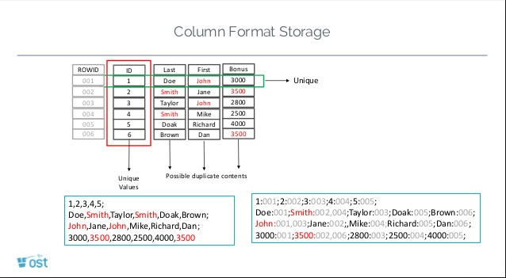
 
Fuente: [NoSQL Database Concepts, Bhaskar Gunda](https://www.slideshare.net/BhaskarGunda/nosqldatabaseconcepts-64494185)

**Ejercicio 1:** ¿Cómo quedaría la siguiente tabla con un formato columnar?

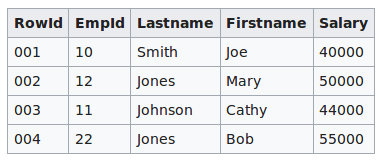
 

#### [AVRO](https://avro.apache.org/)

-   Proyecto de Apache.
- Este **no** es un formato columnar, es un formato de renglón.
-   Un lenguaje de serialización de datos neutral: los datos son descritos a través de un esquema independiente de lenguaje.
-   Guarda el esquema de los los datos -tipos de datos: numérico, string, etc.- en el *header* de cada archivo para que siempre pueda ser leído al mismo tiempo que los datos. Este formato es de tipo *compressible* y *splittable*, características importantes en sistemas de archivos distribuidos ya que son más eficientes en tareas de *MapReduce*.
-   Permite guardar la evolución del esquema ya que el esquema al momento de leer los datos puede ser diferente al momento de escritura -alguna manipulación en los datos puede cambiar su esquema original-.
-   Los esquemas de avro se escriben en JSON o en Avro IDL (C-ish) generalmente.
-   Utiliza tipos de datos simples y complejos: enums, arrays, maps, unions [Avro Data Types](https://avro.apache.org/docs/1.8.1/spec.html)
-   Una de las ventajas más grandes de avro, además de que guarda el esquema, es que se puede leer por otros formatos más adelante en el proceso. Por ejemplo: Es posible leer un avro en Spark y guardarlo como parquet ＼(＾O＾)／.

**Comparaciones entre Avro y Parquet**

Las siguientes comparaciones se realizaron con 2 datasets reales en un spark 1.6, la comparación completa la puedes encontrar [aquí](https://blog.cloudera.com/blog/2016/04/benchmarking-apache-parquet-the-allstate-experience/):

-   *Dataset* 1: Contiene 3 columnas y 82.8 millones de registros en formato CSV con un tamaño original de 3.6GB.
-   *Dataset* 2: Contiene 103 columnas con 694 millones de registros en formato CSV con un tamaño original de 194GB.

1. Cargar los datos:

+ *Dataset* 1

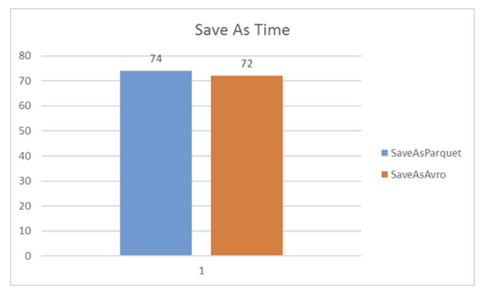
 

+ *Dataset* 2

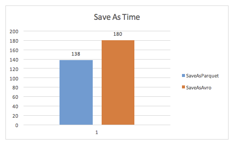  

2. Conteo de observaciones de una columna:

+ *Dataset* 1

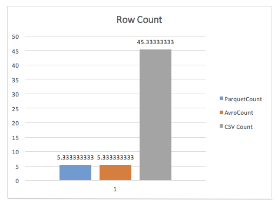
 

+ *Dataset* 2

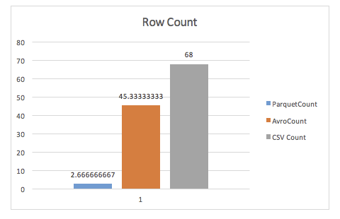
 

3. GroupBy

+ *Dataset* 1

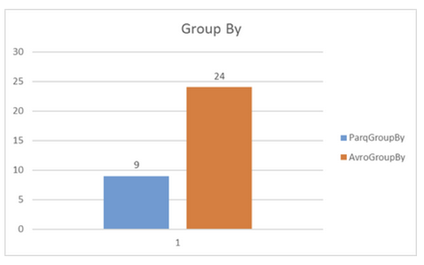
 

+ *Dataset* 2

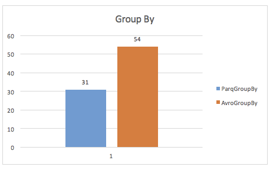
 

4. Map simple

+ *Dataset* 1

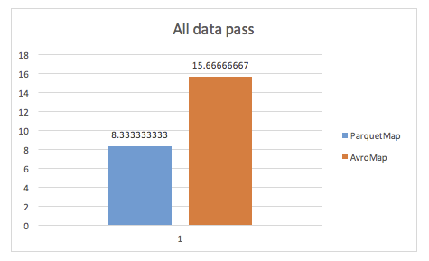
 

+ *Dataset* 2

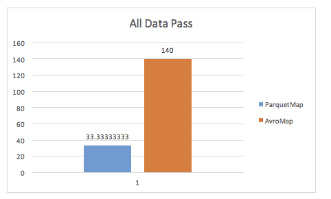
 

5. Espacio en disco

+ Dataset 1

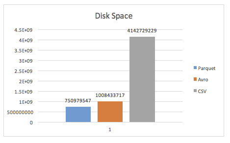
 

+ *Dataset* 2

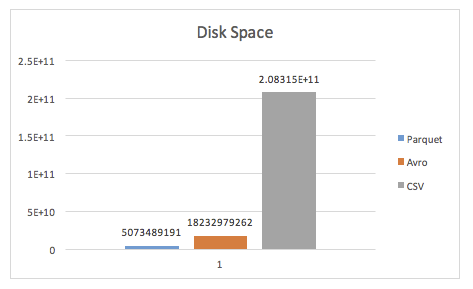
 

##### **Compresión**

En hadoop es importante seleccionar correctamente el formato de archivo que mejor sirva al propósito de lo que queremos hacer, seleccionar el formato incorrecto nos llevará a tener un desempeño pobre en Hadoop.

Normalmente los archivos en HDFS son almacenados en formato comprimido -recordemos que ocupamos HDFS para guardar grandes cantidades de datos!- pero debemos tener cuidado con el formato de compresión ya que hay algunos que no son *splittable* o que son *splittable* pero no secuencial -esto le podría dar en la torre a algún *set* de datos de serie de tiempo!-.

-   **Snappy:** Formato de compresión de Google optimizado para hacer compresiones rápidas con un nivel de compresión razonable, no es *splittable* por lo que requiere de ocuparse con algún formato que lo sea -avro, parquet-.

-   **LZO:** También está optimizado para hacer compresiones rápidas con un nivel de compresión razonable, a diferencia de `snappy`, este formato si es *splittable*. Su desventaja es que no viene como parte de la distribución de Hadoop por lo que hay que hacer otra instalación :(. Formato recomendado para archivos de texto plano.

-   **GZip:** Provee muy buen nivel de compresión a costa de la velocidad de compresión -2.5 veces lo que tarde Snappy, pero casi reduce a la mitad de lo de snappy-. Es igual de bueno en desempeño de lecturas sobre Hadoop pero al igual que snappy no es *splittable* por lo que requiere de ocuparse con algún formato que lo sea -avro, parquet-.

-   **bzip2:** Provee un nivel de compresión excelente -9% mejor que GZip- pero es mucho más lento que cualquier otro formato, en promedio puede tardar 10 veces más que Gzip. Este formato es *splittable* sin embargo no es recomendado para ocuparse en Hadoop por el performance mencionado, se recomienda ocupar solo si es necesario reducir el espacio ocupado en hadoop -> eso solo ocurriría si se ocupa Hadoop como simple almacenador de datos.

-   Si utilizamos avro y/o parquet haremos que cualquier formato de compresión se haga *splittable* ＼(＾O＾)／.

Se recomienda tener un solo formato de archivo en el cluster, y la recomendación incluye ocupar uno que permita guardar esquema, eso solo nos deja avro o parquet. Es posible leer y escribir parquet desde los API de avro, pero no es tan sencillo de parquet a avro.

### ETL

Acrónimo de *Extract Transform Load*, no siempre se ejecutan en este orden, por ejemplo es posible tener un ELT, o solo partes del proceso como EL.

En sus productos de datos, la parte de **extracción** estará asociada a ingestar los datos de algúna repositorio: *bucket*, API, *web scraping*, consultas a un FTP, etc. Es importante mencionar que las fuentes de datos pueden ser diversas y en diversos formatos o protocolos.

Por ejemplo, para los datos de NYC 311 existe el [API](https://dev.socrata.com/foundry/data.cityofnewyork.us/erm2-nwe9) desde donde se pueden hacer solicitudes para bajar sus datos de forma diaria, incluso se incluye el *snippet* de código asociado en diferentes lenguajes.

La parte de **transformación** está asociada a los cambios que se les tienen que hacer a estos datos para que después puedan ser ocupados por otros (aplicaciones, servicios, scripts, otras personas, etc.). Estas transformaciones están más relacionadas a transformaciones de tipos de datos, formatos, estructura; que a transformción de datos para la parte de modelado.

Finalmente la parte de **cargado** está relacionada a tener los datos ordenados y estructurados en algún lugar para que todos los demás los puedan ocupar, generalmente esta parte está asociada a alamcenar los datos en bases de datos, sin embargo, en productos de datos pueden estar asociados a *DataLakes*, bases de datos no estructuradas, servicios de almacenamiento en la nube, servidios de DFS, etc.

Cuando estos 3 procesos ocurren en secuencia de forma automatizada se genera un *pipeline*, aunque todo el mundo le decimos ETL (específicamente a esta parte).

Existen varias arquitecturas disponibles para las partes de ETL, las más comunes son las siguientes:

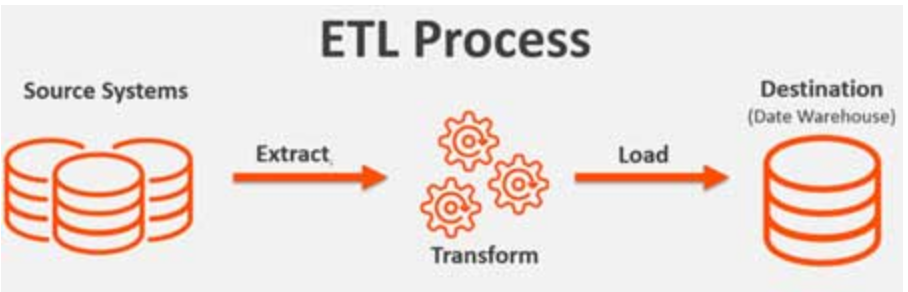
 
Fuente: [Databricks blog](https://databricks.com/glossary/extract-transform-load)

+ Almacenamiento en S3
+ Extracción de S3 y almacenamiento en BD
+ Extracción de S3 y almacenamiento en S3

\*Donde S3 puede ser cualquier servicio de almacenamiento de otras plataformas: Azure, Google Cloud Platform, IBM, etc.

Puedes revisar la documentación del servicio [AWS Pipeline](https://aws.amazon.com/datapipeline/?hp=tile&so-exp=below).

 Generemos el pipeline del ETL de un proyecto ejemplo.

Tenemos los datos de registro de queja sanitaria en propiedad privada [311 de Chicago](https://311.chicago.gov/s/article/Sanitation-code-violations?language=en_US).

Nuestro producto estará asociado a poder priorizar los lugares que requerirán de inspección por alguna violación al codigo sanitario en propiedad privada (*Garbage and recycling*).

+ ¿Con qué frecuencia se publican los datos?
+ ¿Cada cuánto ingestaremos los datos?
+ ¿Cómo ingestaremos los datos?
+ ¿Dónde guardaremos los datos?
+ ¿En qué formato?
+ ¿Los transformamos antes de guardarlos?
