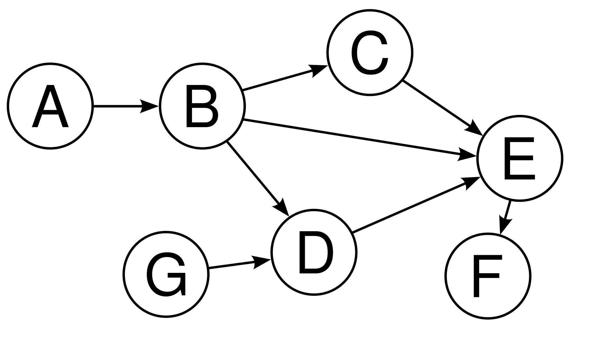
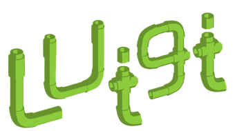
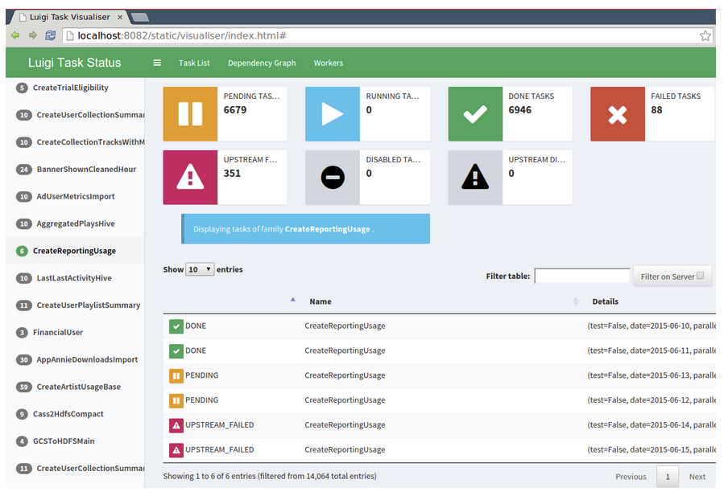
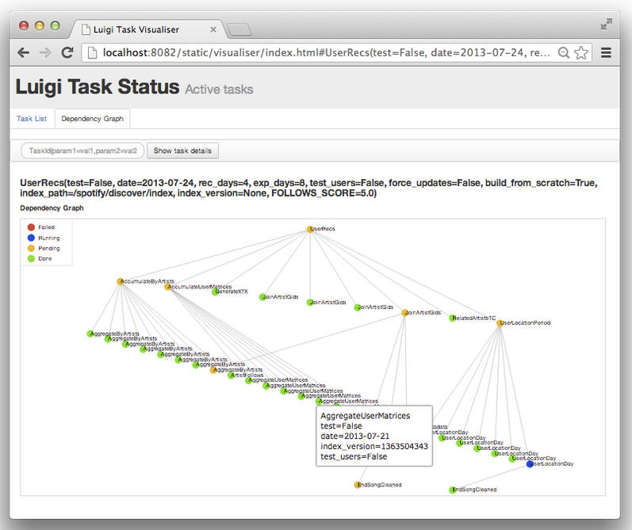
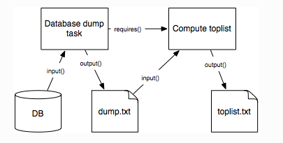
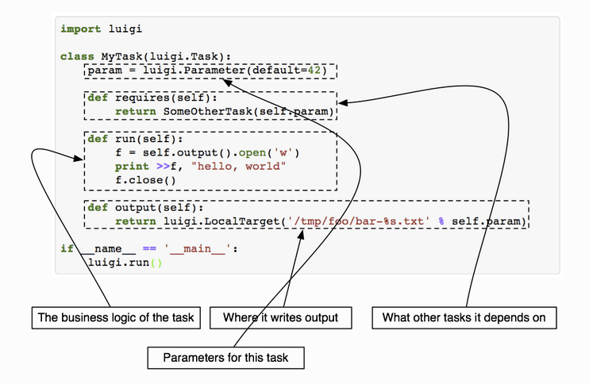
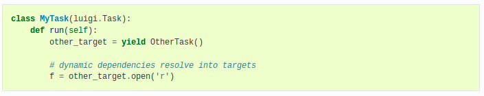
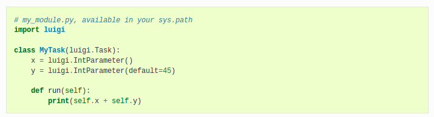

### Orchestration

M. Sc. Liliana Millán Núñez liliana.millan@itam.mx

Febrero 2021

### Agenda

+ Data Pipeline
+ DAG
+ Luigi

#### Data Pipeline

Asi como el ETL es un *pipeline*, agregar todo el procesamiento que requieres durante todas las fases de un proyecto de ciencia de datos forman parte de un *pipeline*, a este *pipeline* en particular le llamamos *data pipeline*.

Un *pipeline* puede estar conformado por diferentes *pipelines*, y estos pueden o no correr en una secuencia o en paralelo. Para ordenar esa secuencia existen los orquestadores, herramientas que nos permiten definir cómo, cuándo y con qué debemos correr cada parte de nuestro *data pipeline*.

Existen varios orquestadores, cada uno con sus respectivas ventajas y desventajas. Los científicos de datos generalmente ocupamos Luigi ya que es muy sencillo de ocupar y está desarrollado para orquestar trabajos de ciencia de datos -aunque no cumple con algunos patrones de diseño muy importantes de ingeniería de software :(-, pero cumple con características que nos facilitan la vida para poder realizar un *data pipeline* sin necesidad de ser "tan" expertos en ingeniería de software.

#### DAG

Acrónimo de *Directed Acyclic Graph*, un grafo acíclico dirigido. Esta estructura de datos conformada por vértices -nodos- y aristas -arcos. Cada arco nodo representa una tarea a ejecutar - *task*- y cada arco la dirección de flujo. No está permitido tener ciclos, más adelante quedará claro el por qué (espero).

 nos permite organizar cómo los diferentes *tasks* de nuestro *data pipeline* correrán. Cada nodo es un *task* y cada arista la dirección que debe seguir el flujo de procesamiento.

Dado que en un DAG *no* hay ciclos, es posible determinar sin ambigüedad qué forma la entrada a un *task*, qué la salida, **qué ya fue procesado y qué no**.

 
Fuente: [What is an acyclic graph](https://medium.com/kriptapp/guide-what-is-directed-acyclic-graph-364c04662609)

**Principios de DAG:**

+ **Idempotencia:** Cuando corremos un proceso muchas veces con los mismos parámetros debemos obtener la misma salida, sin excepción. También implica que no queremos generar salidas repetidas.

+ **Dirección:** El grafo tiene una dirección en un solo sentido.

+ **Acíclico:** La salida de un nodo no puede regresar a uno que ya fue procesado.

¿Por qué un DAG en el orquestador?

+ Evita tener ciclos: Ordenamos el procesamiento
+ Permite tener más de 1 entrada y solo 1 salida
+ Permite ejecutar tareas en paralelo
+ Permite ejecutar **solo la parte necesaria** gracias a su propiedad de idempotencia

Así se ve el DAG de un *data pipeline* orquestado en Luigi:

 ¿Un árbol es un DAG?

### Luigi

+ Orquestador de *pipelines* desarrollado por Spotify en 2012.
+ Convertido a *open source* en 2014.
+ Utiliza un DAG para adminstrar el orden de las tareas en el *pipeline*
+ En Luigi los *pipelines* se diseñan iniciando con la última tarea en ejecutarse, ya que que su diseño incluye obtener los elementos requeridos para ejecutar una tarea, si estos no han sido satisfechos entonces ejecutará antes las tareas que se requiren.

¿Por qué Luigi? (Fuente: dsapp.uchicago.edu)

+ Ventajas
  + Administración minimalista de dependencias
  + *Checkpoints*/Recuperación de fallas
  + Tiene CLI y parametrización
  + Tiene *scheduler* central (el orquestador):
    + Mecanismo de bloqueo
    + Tiene una herramienta de visualización del procesamiento del DAG
  + Integraciones a diferentes *frameworks* de almacenamiento y procesamiento: AWS, Spark, HDFS, Elastic Search, SQLAlchemy, RDS, etc.

+ Deventajas
  + Enfocado a procesamiento en *batch*, Luigi **no** está hecho para procesamiento en *streaming* (o tiempo real)
  + No tiene integrado un *trigger* (puedes ocupar cron o travis)
  + No soporta ejecución distribuida

¿Quiénes ocupan Luigi?

+ Spotify
+ Foursquare
+ Groupon
+ Red Hat -marketing operations-
+ The Wall Street Journal
+ Squarespace
+ Deloitte

En México solo sé que Klustera ocupaba Luigi para su *pipeline* sin embargo, desconozco si sigue así.

En Datank ocupábamos *Pachyderm* por una necesidad puntual de tener trazabilidad, desconozco si lo siguen ocupando.

#### Instalación

Luigi tiene un *server* y un *worker* (al menos). Puedes instalar Luigi en tu máquina (o en máquinas EC2), o bien puedes ocupar una imágen de Docker que tenga Luigi -hay varias en DockerHub- ya sea en tu máquina o en las EC2.

Para instalar Luigi necesitarás correr `pip install luigi` (en tu pyenv!)

Luigi incluye una página web para interactuar con los diferentes *pipelines* que tengas implementados en Luigi, así como los tasks que los componen:

 
Fuente: [Documentación de Luigi](https://github.com/spotify/luigi)

Asi como el visualizador del grafo de dependencias en tiempo de ejecución para identificar en dónde se encuentra el *pipeline*, identificar errores en algún *task*, o bien para verificar que nuestra definicion del grafo de dependencias está correcto.

   Fuente: [Documentación de Luigi](https://github.com/spotify/luigi)

Si bien Luigi ya tiene *templates* para tasks que generalmente se ocupan en *pipelines* de Ciencia de Datos, también es posible definir nuestros propios *templates*.

#### ¿Cómo funciona Luigi?

Luigi tiene 2 objetos principales para construir su DAG:

1.  **Target**: De dónde sacar los datos que requiere una tarea. Estos datos pueden estar en un archivo en disco, en hdfs, en s3, en una BD. Luigi tiene diferentes *templates* ya definidos:

+ `LocalTarget`
+ `HdfsTarget`
+ `S3Target`
+ `RemoteTarget`
+ `MySqlTarget`
+ `RedshiftTarget`
+ `PostrgresTarget`
+ ... otros

2.  **Task**: La tarea que queremos que Luigi administre como parte del *pipeline*. Para declarar un *task* en Luigi tenemos que hacer un *script* que tenga los siguientes 4 métodos requeridos -algunos son opcionales-: `run()`, `input()` ,`output()` y `requires()`.

+ `requires()`: El método a través del cuál definimos cómo está formado el grafo de dependencias entre tareas. Por ejemplo: Si tenemos una tarea que limpia los datos de profeco `clean.py`, y otra que transforma los datos `transform.py`, la tarea `transform.py` tendría un `requires()` que indique que se requiere de `clean.py`, esta instrucción le permite saber a Luigi que se **requiere** primero correr la tarea de `clean.py` antes de correr la de `transform.py`.

+ `output()`: Qué genera de salida esta tarea y sobre todo, **dónde** se queda persistida. Este método siempre regresa un objeto de tipo `Target`, $leftarrow$ sólo devuelve **un** `Target` por `Task` de esta manera aseguras que un `Task` haga 1 sola cosa -atomicidad, uno de los prinicipios de ingeniería de SW-.

+ `input()`: Qué requiere de entrada esta tarea y sobre todo, de **dónde** debemos ir a obtenerla -Luigi-.

+ `run()`: El código que queremos qeu se corra.

   Fuente: [Documentación Luigi](https://luigi.readthedocs.io/en/stable/workflows.html)

Es muy común que se requiera enviar uno o más parámetros a un *task* pertenciente a un *pipeline* y para ello se ocupa un objeto `Parameter` ver la [documentación](https://luigi.readthedocs.io/en/stable/parameters.html). Por ejemplo: enviar una fecha al flujo para que la salida de un archivo contenga la fecha de ejecución.

  

Es posible tener dependencias dinámicas, esto significa que cuando estamos construyendo el grafo de dependencias no estamos completamente seguros de las dependencias que una tarea tendrá, sino hasta que estamos en *runtime*. Para administrar estas dependencias dinámicas Luigi ocupa una estrategia de *yield* para esperar a que termine una dependencia, es alternativo al `requires()` y se ocupa dentro de `run()`.

La desventaja de ocupar `yield()` es que si se vuelve a correr el *pipeline* y las dependencias ya se cumplieron, al ser declaradas como `yield` se vuelve a ejecutar desde 0 :(, es por eso que siempre preferimos declarar explícitamente el grafo de dependencias desde la creación del workflow con `requires`.

   Fuente: [Documentación Luigi](https://luigi.readthedocs.io/en/stable/tasks.html#dynamic-dependencies)

Podemos correr procesos de Luigi de 2 maneras:

1.  Desde línea de comandos

`luigi --module nombre_script nombre_Task --local-scheduler` o `luigi -m nombre_script nombre_Task --local-scheduler`. Si la tarea requiere de algún parámetro, se envía desde aquí. Por ejemplo:

 
Fuente: [Documentación Luigi](https://luigi.readthedocs.io/en/stable/running_luigi.html)

El *task* anterior se correría con `luigi -m ex1 MyTask --x 123 --y 456 --local-scheduler`

Otra manera de ejecutar un *pipeline* de Luigi desde línea de comando es:

`python -m luigi --module ex1 MyTask --x 123 --y 345 --local-scheduler`.

 Si el nombre del parámetro tiene un guión bajo `_` se tiene que reemplazar por un guión alto `-` en la llamada desde línea de comando -no hace falta cambiarlo internamente-.

2. Desde Python

Para correr Luigi desde un *script* de Python hay que agregar en el main un `luigi.build()` que incluya el nombre de la tarea.

Para ocupar el *Central Scheduler* tienes que correr el comando `luigid` en una terminal para que se inicie el visualizador → los tasks que quieras que se visualicen y administren desde aquí no deben llevar la bandera `--local-scheduler`. Para ver el *scheduler* central debes abrir una ventana en tu explorador de preferencia y buscar en el puerto 8082 -`localhost:8082`.

$\rightarrow$ La forma en la que tu la ocuparás generalmente será por línea de comando a través de un script en *shell* para ejecutar con un cron cada $x$ tiempo.

#### Ejemplos de Luigi

+ Clase sencilla, pasando parámetros (`ex1_luigi.py`)
+ Output a un archivo local (`ex2_luigi.py`)
+ Output a un archivo de S3 (`ex3_luigi.py`)

### Otros orquestadores

+ [Airflow](https://airflow.apache.org/): Más utilizado por Data Engineers.
+ [Pachyderm](https://www.pachyderm.com/): Agrega trazabilidad
+ [Oozie](http://oozie.apache.org/): Para orquestamiento de trabajos de *map/reduce*.

### Referencias

+ [Luigi API Documentation](https://luigi.readthedocs.io/en/stable/api/luigi.html)
+ [Luigi](https://github.com/spotify/luigi)
+ [Ejemplo luigi](https://github.com/spotify/luigi/tree/master/examples)
