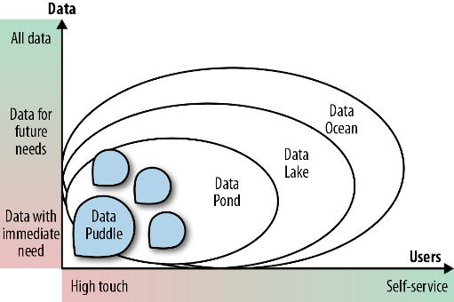
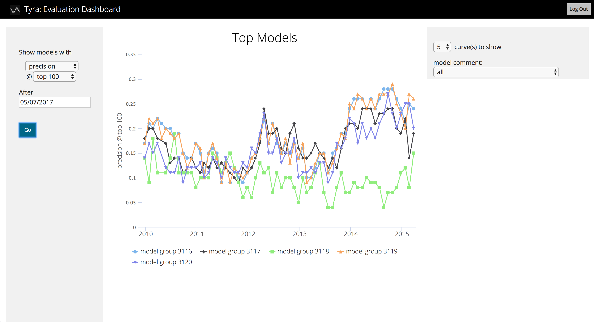

M. Sc. Liliana Millán Núñez liliana.millan@itam.mx

Marzo 2021

## Data governance en ML

### Agenda

+ *Data governance*
+ Herramientas de *Data Governance*
  + *Metadata*
  + *Data lineage*
+ *Machine Learning Governance*

### Data governance

Consiste en la administración del *asset* más importante de una empresa, sus datos.

Su auge en las empresas se debe a la necesidad de cumplir con temas de regulación y privacidad de datos, sin embargo, una vez que *advanced analytics*, *big data*, *artificial intelligence*, *machine learning*, *data science* se pusieron de "moda", la gobernanza de los datos cobró aún mayor fuerza.  

#### Beneficios que habilita *Data Governance* en una empresa:

+ Identificar datos personales y validar que en todos los ecosistemas en los que se encuentren, se cumpla con la regulación legal.
+ Identificar la calidad de los datos.
+ Ayuda a integrar datos que se almacenan de forma no estructurada a través del *Data Lake*.
+ Resulta en una buena estrategia para validar que los datos están limpios, son precisos, usables y seguros.
+ No puede haber una cultura de toma de decisiones basada en datos sin tener gobernanza de datos (*Data Driven Culture Organization*).
+ Al ser los datos tratados como un *asset* nos permite administrarlos activamente y por lo tanto extraer su máximo valor: compartirlos, enriquecerlos.
+ Minimizar los riesgos asociados a una administración de datos pobre -por no decir inexistente!-.

Un proyecto de gobernanza de datos exitoso requerirá de alinear personas, procesos y tecnologías para identificar, clasificar y documentar información de los datos de una compañía.

```
## Rob notes
- Normalmente se cree que un "data lake" es suficiente para tener gobernanza de datos. No es cierto.
- El rol de CDO es el que se encarga de administrar todos los datos. El tiene la última palabra en cuanto al uso de modelos.
```
#### Data Lakes

Repositorio de almacenamiento de datos de una empresa/entidad.

La mejor manera de iniciar con gobernanza de datos es a través de un caso de uso o proyecto, ya que en lugar de meter todos los datos posibles al *data lake*, utilizamos únicamente los que nos están brindando un valor inmediato y capitalizable en ese proyecto en particular.

Niveles de madurez en *Data Lake*.

+ *Data puddle:* Repositorio de datos *Single-purpose* o datos de un solo proyecto (*single-project*). Este repositorio utiliza tecnologías de "big data". Los datos que viven en este *Data puddle* son utilizados normalmente por un solo equipo o en 1 solo proyecto, por lo que el contenido es conocido y entendido por los miembros del equipo.

 ¿Por qué no ocupar entonces un RDS normal?

+ *Data pond:* Una colección de al menos 2 *data puddle* **aunque** en tecnologías clásicas de almacenamiento de datos como un *datawarehouse* o un *data mart*.

+ *Data lake:* También contiene al menos 2 *data puddle*, sin embargo, se diferencia del *data pond* en dos cosas:
  + Permite hacer *self-service* lo que implica que los usuarios de negocio pueden encontrar y usar los datos que viven en el **sin** tener que depender de la ayuda del departamento de TI.
  + También tiene datos que los usuarios de negocio pueden querer aunque no haya un proyecto que lo requiera en ese momento.\*

+ *Data ocean:* Expande los servicios que permite el *data lake* a todos los datos de la empresa habilitando la cultura *data driven* de la compañía.


<br>
Fuente: [The enterprise big data lake](https://www.oreilly.com/library/view/the-enterprise-big/9781491931547/ch01.html)

Si no hacemos *data governance* de forma adecuada, lo que haremos es que iniciaremos con un hermoso *data lake* y pronto lo convertiremos en un *data swamp* -un *data lake*- cuya administración de *metadata* está rota o es inexistente.


<br>
Fuente: [Kiran Donepudi](https://www.linkedin.com/pulse/data-lake-swamp-kiran-donepudi/)

```
## Rob notes
- Antes del Data Lake era Data Warehouse
- Surgieron por la necesidad de unificar verdades en una empresa.
  - Si preguntan cuántos clientes tenemos, todos deben coincidir.
- También sirven mucho para el tema del reporteo.
- El data warehouse es muy estricto, tiene muchas trabas para meter información.
- El data lake trata de ser más flexible.
- Se vuelve un data swamp cuando no tiene gobernanza, cuando solo se almacenan cosas sin control.
- El chiste es que se tenga un propósito para los datos, y se conozcan bien los metadatos.
```
#### Organización sugerida de un Data Lake

+ *Raw* o *landing zone*: Donde la ingesta de datos es almacenada y se queda lo más "cerca" posible a su estado original.  
+ *Gold* o *production zone*: Donde todos los datos están limpios y procesados.
+ *Dev* o *work zone*: Donde la mayor parte de usuarios técnicos están: *data scientists* y *data engineers*. Esta zona debe estar muy bien organizada, por ejemplo, por usuario, proyecto, tema, etc.
+ *Sensitive*: Donde viven los datos sensibles.  


<br>
Fuente: [The enterprise big data lake](https://www.oreilly.com/library/view/the-enterprise-big/9781491931547/ch01.html)

### Herramientas de Data Governance

#### Metadata

Descripción de las características de tus datos, o datos de tus datos.

En el contexto de *data governance*, *metadata* habilita el *data governance* y tiene la responsabilidad de definir políticas y proveer acceso a los datos. Estas políticas, que resultan en la administración de la *metadata*, incluyen:

+ Definición de datos
+ Uso de los datos
+ Seguridad de los datos
+ Organizar la información de los datos para que éstos puedan ser buscados por los usuarios de negocio.
+ Enriquecer y mantener registro detallado del flujo de datos.
+ Linaje de los datos

La administración de esta *metadata* resulta crucial para mantener disciplina y control en la recolección de datos durante el *data governance*, algunas responsabilidades dentro de esta administración son:

+ Asegurar que la *metadata* es creada y capturada en el mismo punto de creación de esos datos
+ Almacenar esta *metadata* en un repositorio adecuado para utilizar por diferentes aplicaciones
+ Controlar y remover inconsistencias y redundancias en los datos

**Data Steward**

Un nuevo rol dentro de *data governance* que se enfoca más a la zonas *sensitive* y *gold* para asegurar que los datos que viven ahí cumplan con la regulación de la compañian y de la gobernanza de datos.

**Gobernanza de datos por zona**


<br>
Fuente: [The enterprise big data lake](https://www.oreilly.com/library/view/the-enterprise-big/9781491931547/ch01.html)


#### Data Lineage

El linaje de tus datos.

De acuerdo a la *International Association of Data Management Professionals* ([DAMA](https://dama.org/), existe un [capítulo para México](http://dama.gxpsites.com/)), *data lineage* está definido como el camino a través del cual los datos se mueven desde su punto de origen a su punto de uso (dentro de una empresa), así como la descripción de lo que pasa a los datos conforme fluyen a través de la organización.

Tener la trazabilidad sobre todas las transformaciones que se han hecho a los datos en todo el *pipeline*, tanto técnicas como de negocio. Podemos identificar qué transfornación se hizo en qué momento y por quién.

 Para poder hacer *data lineage* se requiere tener *metadata*.

A través de conocer este **ciclo de vida** de los datos podemos conocer los puntos donde los datos son accesados, usados, reportados, cambiados o usados para generar nuevos datos.


**¿Por qué necesitamos Data Lineage?**


<br>
Fuente: [The Blond Coummunicator Blog](https://theblondecommunicator.wordpress.com/2016/06/29/broken-telephone/)

+ Transparencia en procesos de Data Science -*Data pipeline*- incluyendo el modelado
+ Ganar confianza de los usuarios que utilizarán este modelo
+ Cumplir con regulaciones oficiales: General Data Protection Regulation (GDPR), California Consume Privacy Act (CCPA) etc.
+ Permite mantenernos alerta (como empresa) de vulnerabilidades y amenazas a nuestros datos. $\leftarrow$ En caso de tener una brecha de seguridad, la empresa debe poder responder en minutos al saber dónde vive qué y por dónde pasa.

**Metadata para habilitar data lineage en tu data pipeline**

 ¿Qué se te ocurre que debamos guardar como metadata de tu *data pipeline*?

Tan solo en tu ETL:

+ *Raw*
  + Fecha de ejecución
  + Parámetros con los que ejecutaste tu *task*
  + Quién ejecutó el task (usuario)
  + Desde donde se ejecutó (ip, instancia EC2)
  + \# de registros ingestados
  + Nombre del archivo generado
  + Si el *load* ocurre en S3, la ruta de almacentamiento incluyendo el bucket
  + Si el *load* ocurre en BD, nombre de la base de datos, esquema, tabla
    + Usuario en BD
  + Variables (en el orden en el que aparecen)
  + Tipos de datos  
  + Qué script se ejecutó (*tag* de github)

+ *Preprocessed*
  + Fecha de ejecución
  + Quién ejecutó (usuario)
  + Qué se ejecutó: Debería ser lo más granular posible (y atómico). Por ejemplo, si hiciste un cambio de formato de JSON a Parquet.
  + *Tag* de código de github que se ejecutó
  + Dónde se ejecutó
  + Idealmente \# de registros modificados
  + Estatus de ejecución: Fallido, exitoso, etc.

+ *Clean*
  + Fecha de ejecución
  + Quién ejecutó (usuario)
  + Dónde se ejecutó
  + Qué se ejecutó: Debería ser lo más granular posible (y atómico)
  + *Tag* de código de github que se ejecutó
  + Idealmente \# de registros modificados
  + Estatus de ejecución: Fallido, exitoso, etc.

  ¿Quién genera esta *metadata*? ... ¡Tú!, a través de tus *tasks*.

### Machine learning governance

Para poder habilitar la parte de *Data Lineage* en nuestro proceso de modelado deberemos incluir la generación de *metadata*.

Para ello ocuparemos como método de almacenamiento una base de datos relacional (Postgres)


<br>
Fuente: [DSSG Blog](http://www.dssgfellowship.org/2018/02/08/tech-lessons-learned-implementing-early-intervention-systems-in-charlotte-and-nashville/)

+ `model_group`: Una combinación única de las características de un modelo: tipo de modelo, hiperparámetros del modelo, *random seed*, *features* utilizados. Cada uno de esos *model group* son considerados 1 experimento.

+ `models`: Cada *model group* o experimento está entrenado con un *set* de datos de entrenamiento, este *fit* se queda almacenado en esta tabla.

+ `predictions`: Las predicciones generadas con la combinación de experimento (*model group*) y set de entrenamiento (*model*) se almacenan en esta tabla.

+ `evaluations`: Las métricas de desempeño *off-line* se quedan almacenadas en esta tabla, así como el tiempo que tardó en entrenarse!  

+ `feature_importances`: Esta tabla almacena la importancia de las variables ocupadas en el experimento.

+ `individual_importances`: Esta tabla almacena la importancia de variable para cada predicción.

No necesariamente tendremos que ocupar todas, o todos los campos asociados. En nuestro caso las primeras 4 será necesarias.

Ahora, para cuando estemos en producción, necesitaremos de otro conjunto de tablas que nos permita almacenar *metadata* de ese proceso, estas tablas vivirán en otro esquema (*production*).

+ `models`: Almacenamos los modelos que hemos puesto en predicción (incluida su versión)

+ `predictions`: Almacenams las predicciones realizadas por el modelo que se encuentra en producción.

+ `feature_importances`: Almacenamos la importancia de variables para este modelo productivo.

+ `individual_importances`: Almacenamos la importancia de variables por predicción realizada.

Seguramente para tu problema en particular necesitarás generar algunas tablas adicionales que almacenen *metadata* importante. Por ejemplo, deltas de cambios de estado: de intervenir a no intervenir, delta de rankeo, etc.

 ¿Por qué almacenamos todo esta *metadata* en una BD relacional?

Hacerlo en una RDBMS nos permitirá almacenar miles de millones de registros, indexarlos y analizarlos en cuestión de segundos.

Será muy sencillo generar *fronts* (casi siempre *dashboards*) que puedan visualizar la *metadata* -información- que se está generando en nuestros *pipelines*.

Por ejemplo, una vez que se tiene alamacenada toda esta información se puede generar un *dashboard* de este estilo, con el cuál tanto nosotros como nuestros clientes/*partners*/usuarios podemos tomar decisiones basadas en los datos (¡predicar con el ejemplo!).


<br>
Fuente: [DSSG Blog](http://www.dssgfellowship.org/2018/02/08/tech-lessons-learned-implementing-early-intervention-systems-in-charlotte-and-nashville/)


<br>
Medición de *accuracy* en el tiempo. Fuente: [DSSG Blog](http://www.dssgfellowship.org/2018/02/08/tech-lessons-learned-implementing-early-intervention-systems-in-charlotte-and-nashville/)

### Herramientas/Frameworks para data lineage y ml governance

+ [ArangoML](https://www.arangodb.com/machine-learning/)
+ [Pachyderm](https://www.pachyderm.com/)
+ [DVC](https://dvc.org/)
+ [MLFlow](https://mlflow.org/)

### Referencias

+ [DSSG Model Governance](https://dssg.github.io/triage/dirtyduck/ml_governance/)
+ [DSSG Blog](http://www.dssgfellowship.org/2018/02/08/tech-lessons-learned-implementing-early-intervention-systems-in-charlotte-and-nashville/)
