M. Sc. Liliana Millán Núñez liliana.millan@itam.mx

## Pipelines de transformación de datos

### Agenda

+ Spark
  + Introducción a Spark
    + Diferencia con MapReduce
  + Teoría de Spark
    + Ecosistema
    + Arquitectura
    + Spark programming model
    + SparkContext, SparkSession
  + SparkSQL
+ Modin
+ Koalas

### Spark

#### Contexto

¿Por qué existe Spark?

Spark fue creado pensando en poder hacer todas las tareas de un científico de datos en una misma herramienta, incluida la limpieza, procesamiento de datos, análisis de datos, modelado.

La tarea de un *data scientist* no termina cuando tenemos el mejor modelo, termina cuando lo ponemos como una aplicación de datos que está en el mundo real alterando la realidad para la que fue creado. Hacer que esta aplicación de datos se convierta en parte de un servicio productivo requiere -normalmente- de que sea reconstruido.

Dada esta característica es muy importante diferenciar entre hacer analítica de laboratorio y analítica para producción, en la primera estamos enfocados en análisis exploratorio tanto de datos como de modelos, en la segunda nos concentramos en analítica operativa haciendo que lo que desarrolamos en la analítica de laboratorio sea empaquetada de forma en que pueda informar decisiones en el mundo real. La analítica de laboratorio sucede en lenguajes como R, Octave e incluso Python, mientras que la analítica para producción los algoritmos o *pipelines* se reescriben en Python cumpliendo con patrones de diseño de ingeniería de software, Java o C++ para cumplir con los tiempos de respuesta.

Claramente sería mejor que el lenguaje ocupado en el análisis de laboratorio sea el mismo que para el análisis para producción optimizando tiempos y recursos para llegar más rápido a producción y modificar la realidad... sin embargo R es lento y carece de falta de integración a los lenguajes e infraestructura que normalmente se ocupa en producción, y C++ o Java son herramientas HORRIBLES para hacer análisis exploratorio sobre todo por que no son herramientas REPL -*Read Evaluate Print Loop*-

#### Introducción


Spark fue creado en el laboratorio [AMPLab](https://amplab.cs.berkeley.edu/) de la Universidad de Berkeley (2014), también forma parte del Apache Software Foundation y es considerado como la primer solución *open source* de procesamiento distribuido hecha para *Data Scientists*.

Es considerada como la evolución de *MapReduce* de Hadoop. *MapReduce* revolucionó el procesamiento de datos de gran escala al permitir procesamiento en paralelo y que al aumentar el tamaño de los *data sets* el aumento en recursos computacionales es casi lineal! ... al aumentar el tamaño del *data set* podemos escalar horizontalmente para que los trabajos se completen en el mismo tiempo, es resilente a las fallas en *hardware* -replicación de datos-.

Spark también mantiene la escalabilidad lineal y la tolerancia a fallos, pero **extiende** *MapReduce* en 3 formas:

1.  En lugar de tener un formato rígido de *map* $\rightarrow$ *reduce*, Spark ejecuta operaciones más generales a través de un DAG -*Directed Acyclic Graph*- la implicación más grande de este cambio es que mientras que *MapReduce* requiere de escribir constantemente al DFS seleccionado para poder pasar resultados intermedios del *map(pers)* al *reducer(s)*, Spark sólo **pasa** los resultados intermedios al siguiente "paso" en el *pipeline*.

2.  Spark complementa las mejoras que brinda la estructura de DAG con un conjunto de transformaciones que permiten al usuario expresar los procesamientos de manera más natural por lo que se pueden expresar *pipelines* complejos en pocas líneas de código.

3.  Spark permite tener procesamiento en memoria a través de las abstraciones *Dataset* y *DataFrame* con las que es posible que podamos materializar cualquier punto de procesamiento de un *pipeline* en memoria por lo que si hay *steps* más adelante en el *pipeline* que ocupen estos datos no requieren de ser reprocesados o vueltos a cargar de disco!!!. Esta característica permite que Spark sea el *framework* seleccionado en algoritmos iterativos que requieren de pasar varias veces sobre un set de datos. Esta es característica de modelado!.

La razón más importante para seleccionar Spark por sobre otros *frameworks* es que resuelve varios de los retos de ciencia de datos:

-   El cuello de botella más grande para hacer productos de datos no es el CPU, ni la memoria, ni el disco, ni la red sino la productividad analítica. Spark permite hacer el *pipeline* desde preprocesamiento hasta evaluación del modelo en un solo ambiente!, lo que acelera los tiempos de desarrollo.
-   Spark tiene una serie de librerías que le aportan las características de un REPL.
-   Los API de Spark proveen de funcionalidad para hacer transformaciones de datos ya sea en funciones estadísticas, *machine learning* o álgebra matricial para hacer ETLs.
-   Es posible ocupar Spark utilizando Python, R, Java o Scala.
-   La capacidad de Spark de mantener objetos en memoria lo hace ideal para hacer *machine learning*.
-   Spark reduce el espacio entre analítica de laboratorio y analítica para producción.

Spark está integrado a muchas de las herramientas del ecosistema de Hadoop:

-   Puede leer y escribir de la mayoría de los formatos propios de Hadoop: Avro y Parquet son los más importantes.
-   Puede leer de bases de datos SQL como PostgreSQL solo se requiere de tener el driver JDBC correspondiente.
-   Puede leer y escribir de bases de datos NoSQL como Cassandra, HBase.
-   Tiene una librería para *streaming* -*Spark Streaming*- que puede ingerir de sistemas de *streaminig* como Storm y Kafka.
-   Tiene una librería para SQL -SparkSQL- con la que se puede interactuar con el metastore de Hive o los datos que cargarmos a través de Parquets o Avro.
-   Puede correr con YARN lo que permite compartir recursos del cluster dinámicamente.

 ... Por cierto, Spark está desarrollado en Scala, por lo que la gente que desarrolló Spark sugiere **fuertemente** utilizar Scala...pero, puedes ocupar **PySpark** -un *wraper* de Python para Spark- (también puedes conectar R con Spark con la libería **sparklyr**, por cierto, un mexicano está en el desarrollo de esta librería （っ＾▿＾）-Javier Luraschi-)

#### Teoría de Spark

##### Ecosistema de Spark

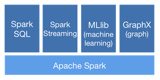 Fuente: [Spark overview](https://spark.apache.org/docs/2.3.0/cluster-overview.html) <br>

-   SparkSQL: La librería que le permite a Spark ingestar, limpiar, analizar y manipular datos como **dplyr** (EDA).
-   Spark MLlib: La librería que le permite a Spark realizar *machine learning*, como **scikitlearn**.
-   Spark GraphX: La librería que le permite a Spark hacer análisis y representación de grafos, como Neo4j y la librería de **networkx** de Python.
-   Spark Streaming: La librería que le permite a Spark hacer análisis en *streaming*.

#### Arquitectura de Spark

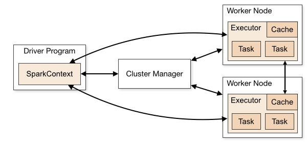
<br>
Fuente: [Overview Spark](https://spark.apache.org/docs/2.3.0/cluster-overview.html)

-   Cada aplicación de Spark está coordinada por el *SparkContext* también se le conoce como *driver*.
-   El *SparkContex* se conecta al *cluster manager* que puede ser de diferentes tipos: YARN, Mesos -otro cluster manager- , Kubernetes (la última version, 2.3.0) -centrado en infraestructura en contenedores- o un cluser standalone. El *cluster manager* como YARN es el que adminstra todos los recursos en el cluster.
-   En los nodos del cluster se crean *Executors* que son procesos que correrán el procesamiento y que guardarán datos de la aplicación -*job* de *MapReduce*-.
-   El *cluster manager* será el responsable de enviar el código de la aplicación -en un JAR si se ocupó Scala o en Python si se ocupó pyspark- a los *executors*.

**Características:**

-   Esta arquitectura no permite que se puedan compartir datos entre diferentes aplicaciones de Spark -diferentes *SparkContext* sin que tengan que escribir a un sistema de almacentamiento (DFS).
-   Spark es agnóstico a la tecnología ocupada como administrador de cluster!.
-   El *driver* debe estar disponible para escuchar y aceptar conexiónes de los *executor* a.k.a. *workers*.
-   Como el *driver* es el que registra trabajos en el cluster debe correr cerca de los nodos trabajadores *workers* por lo que ambos se sugiere deben estar al alcance en la misma área local de red.

#### Spark programming model

Hacer un programa en Spark consiste a grandes rasgos de los siguientes 3 pasos:

1.  Definir un conjunto de transformaciones en el conjunto de datos de entrada -que normalmente se encuentra en algún sabor de DFS-.
2.  Invocar acciones que hacen que la salida de las transformaciones hechas a los datos sea persistida o regresarlos a la memoria local.
3.  Hacer procesamiento local de los resultados obtenidos de forma distribuida.

#### Spark Shell

 Levantar un cluster de EMR, mostrar el shell.

Es el REPL de Spark, por default es para Scala, aunque tambien existe un *shell* para Python :) -**pyspark**-. Esta consola nos permite definir funciones y manipular datos, es como R sin IDE.

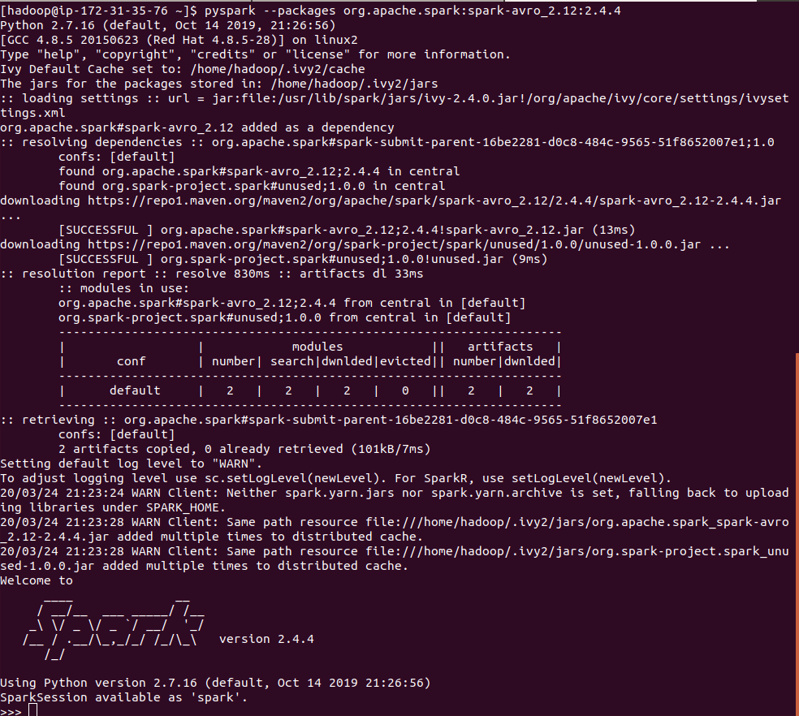 <br>

-   `:help` para ver todos los comandos disponibles en el *shell*.
-   `:history` permite buscar nombres de variables o funciones que han sido generadas anteriormente en la sesión.
-   `:paste` permite insertar en la consola algo copiado del *clipboard* (cualquier cosa fuera de Spark).

#### SparkContext y SparkSession

El objeto más importante dentro de Spark es **Resilent Distributed Dataset** (RDD), una abstracción que representa una colección de objetos que puede ser distribuido en varios nodos de un cluster. Un RDD representa una forma de describir los procesamientos que queremos realizar en nuestros datos como una secuencia de pasos independientes y pequeños. Hay dos maneras de crear un RDD:

1.  Utilizar el *SparkContext* para crear un RDD de una fuente externa.
2.  Ejecutar una transformación en uno o más RDDs.

→ Todo en Spark son **acciones** o **transformaciones** y solo las acciones hacen que el procesamiento distribuido se lleve a cabo -antes no, ¡Spark es lazy!-. Las transformaciones son las operaciones que realizamos a los datos para "modificarlos": filtros, agregaciones, intersecciones, uniones, joins, etc. [Transformations](https://spark.apache.org/docs/2.2.0/rdd-programming-guide.html#transformations).

Una acción hace que todas las transformaciones definidas antes de la acción se ejecuten en el cluster\*, algunos ejemplos de acciones son: `count`, `collect`, `first`, `take`, `saveAs`, `foreach`, `show`, etc. [Actions](https://spark.apache.org/docs/2.2.0/rdd-programming-guide.html#actions)

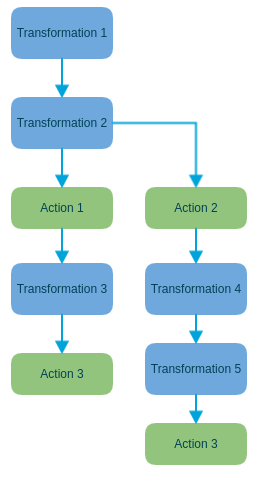 <br>

En Spark un **DataFrame** es una abstracción construida arriba de un RDD **no** son semejantes a los *dataframes* de Python Pandas o a R principalmente porque un DataFrame en Spark representa data sets distribuidos en un *cluster*, no datos locales donde cada renglón está en la misma máquina -pequeña sutil diferencia-. Para trabajar con los *DataFrames* se ocupa el *SparkSession*, para trabajar directamente con los RDD se ocupa el *SparkContext*.

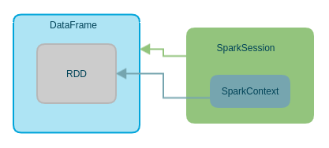 <br>

*SparkSession* permite tener acceso a las funciones de SQL de Spark y a trabajar directamente con el DataFrame, *SparkContext* permite trabajar directamente con el RDD y hacer paralelización explícita. Desde Spark 2.x trabajamos directamente con el SparkSession, aunque sigue siendo posible trabajar con el *SparkContext* y el RDD. Un *SparkSession* siempre contiene al menos un *SparkContext*.

Debido a que *SparkSession* es un *wrapper* al *SparkContext*, la única forma de acceder al *SparkContext* es a través del *SparkSession*.


### SparkSQL

El módulo de Spark que nos permite realizar manipulaciones y transformaciones a los datos. [Spark SQL Documentación API](https://spark.apache.org/docs/latest/sql-programming-guide.html)

Cuando levantas el EMR la variables `spark` ya se encuentra creada. Esta varible contiene el *SparkSession* por lo que es posible

#### I/O

+ **CSV:**
  + Lectura: `df = spark.read.csv("path/to/file/in/dfs")`
  + Escritura: `df.write.csv("path/for/writing/name.csv")`

+ **JSON:**
  + Lectura: `df = spark.read.format("json").load("path/to/file/in/json")`
  + Escritura: `df.write.format("json").save("path/for/writing/name.json")`

+ **Parquet:**
  + Lectura: `df = spark.read.parquet("path/to/file/in/dfs")`
  + Escritura: `df.write.format("parquet").save("path/for/writing/name.parquet")`

+ **Avro:**

Para la versión 2.4 hay que cargar el paquete cuando estamos ejecutando pyspark: `$pyspark --packages org.apache.spark:spark-avro_2.12:2.4.4`

Para versiones anteriores a la 2.4 hay que cambiar el paquete para ocupar el de
[Databricks](https://github.com/databricks/spark-avro/blob/branch-4.0/README-for-old-spark-versions.md) que permite la lectura y escritura de avro desde Spark. `$pyspark --packages com.databricks:spark-avro_2.11:4.0.0`

  + Lectura: `df = spark.read.format("com.databricks.spark.avro").load("path/to/file/in/avro")`
  + Escritura: `df.write.format("com.databricks.spark.avro").save("path/for/writing/name.avro")`

+ **Base de Datos:** (Postgres)

Se requiere de cargar el jar que contiene el drive JDBC para poder comunicarnos con la base de datos. `$pyspark --driver-class-path postgresql-9.4.1207.jar --jars postgresql-9.4.1207.jar`

  + Lectura: `df = spark.read.jdbc(url, dbtable, properties={"user":"user", "password"="password"})`
  + Escritura: `df.write.jdbc(url, dbtable, properties={"user":"user", "password"="password"}`

#### Manejo de datos

En Spark puedes manipular los datos a través de 3 objetos:

1. RDD: A través del *SparkContext*, no recomendable porque hay que configurar muchas cosas de paralelización.
2. DataFrames: A través del *SparkSession* y aplicando las funciones de SQL de Spark.
3. Tablas temporales: Estas tablas son como tablas de bases de datos a las cuáles puedes realizar queries directos con SQL o bien aplicar funciones de SQL de Spark. Requiren de un DataFrame como entrada.

 En la carpeta `scripts` se encuentra el archivo `sql_tutorial.json` que pueden cargar en un Zeppelin para ver algunos ejercicios de Spark con Python (pyspark).

### Anexos

#### Foxy-Proxy

En la siguiente liga puedes encontrar cómo configurar Foxy Proxy para que tu *browser* pueda mostrar contenido de los *web services* que ocuparemos en el EMR.

Sigue las [instrucciones](https://docs.aws.amazon.com/emr/latest/ManagementGuide/emr-connect-master-node-proxy.html) para Chrome, la de Firefox a veces funciona, a veces no.

#### Port forwarding

Para que puedas abrir un *browser* en el EMR tendrás que hacer un *port forwarding* a través del cual configuraremos un puerto local que ocuparemos para "ligar" a un puerto en la computadora remota y que podamos ocupar "nuestro" *browser*.

Las instancias de EMR ya tienen una instrucción para que puedas realizar este *dynamic port forwarding* y los puertos asociados a los servicios que ofrecen como Zeppelin, Hive, Hue, etc.

Nosotros ocuparemos este servicio para poder ocupar Jupyter *notebooks* en los EMR.

#### Jupyter en el *cluster*

Puedes tener jupyter en el EMR para que puedas realizar tus scripts ahí, en lugar de el shell de pyspark. Para ello deberás hacer los siguientes pasos:

1. Levantar tu *cluster* EMR que tenga Hadooop y Zeppelin.

2. Instalar jupyter con la siguiente instrucción `sudo pip install jupyter`

3. Configurar las variables de ambiente de pyspark.
+ `export PYSPARK_DRIVER_PYTHON=jupyter`
+ `export PYSPARK_DRIVER_PYTHON_OPTS='notebook --no-browser --port=8888'source .bashrc`

4. Hacer *dynamic port forwarding* de tu local al EMR:
`ssh -i ~/lmillan_itam.pem -N -f -L localhost:8889:localhost:8888 hadoop@dns_de_tu_emr`

El primer puerto -8889- corresponde a un puerto libre en tu computadora local, el segundo puerto -el de EMR- puedes dejarlo como 8888 pues es el que por *default* se asocia a un jupyter notebook. En mi caso -y seguro en el tuyo también-, mi puerto local 8888 ya está ocupado con mi jupyter notebook local, por eso cambié de puerto a uno que está libre. (Para saber si un puerto está ocupado puedes ocupar `lsof -i | grep 8888` en ubuntu).

5. En la instancia de EMR correr `pyspark`, esto levantará un jupyter notebook pero no abrirá un *browser* (no hay donde).

6. En tu máquina local abre una página de chrome: `http://localhost:8889` (o el puerto que hayas forwardeado) y te pedirá un token. El token está en la instancia de EMR donde pusiste pyspark. Copia el resto de la dirección `?/token=xxxxxxx` a tu *browser* local.

¡Listo! ya tienes un jupyter notebook para trabajar con el EMR.   

Puedes encontrar el video asociado a estos pasos [aqui](https://drive.google.com/open?id=1XuNIs-5h1zJkUcpkySCbALT2SeEicP-z).

**Por favor no reproduzcas este video con otros ni compartas en redes o youtube, este material solo es para las personas que están tomando la materia!!!** (*Issues* legales de derechos de autor y privacidad).

#### Zeppelin

 <br>

Proyecto de Apache :)!

Zeppelin (0.82) es un *notebook* multipropósito (piénsalo como un jupyter) que permite ocupar varios *framewokrs* y lenguajes en el *notebook* para realizar análisis de datos en un mismo ambiente, su motor por detrás es Spark, por lo que tiene todas las integraciones a los diferentes elementos del ecosistema de Spark.

A través de Zeppelin es posible ralizar ingesta de datos (de HDFS y S3), análisis de datos, visualización de datos y colaboración.

 <br>

Para ocupar los diferentes intérpretes dentro de Zeppelin basta con agregar antes de cualquier cosa el nombre del *engine* que tiene que ocupar Zeppelin para "interpretar". Por ejemplo, para ocupar el intérprete de python hay que poner `%python` también se puede poner un sabor específico de python como `%python.conda`.

Zeppelin tiene integrado matplotlib, pandas, md, shell

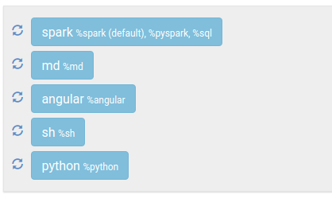 <br>

-   Pyspark

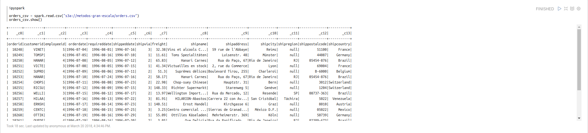 <br>

-   Python

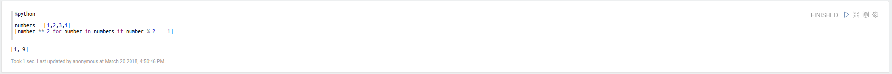 <br>

-   Shell

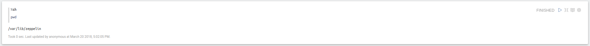

-   md


Nosotros necesitaremos Zeppelin para poder interactuar con Spark de manera más natural en nuestro cluster de EMR. Para que puedas abrir un *notebook* de Zeppelin necesitarás conectarte al puerto 8890 dentro de un *browser* de la instancia master de tu *cluster*.0

 Ve el video de `zeppelin.mp4` que está compartido en esta [liga](https://drive.google.com/open?id=1r8y7U4p0fUv6lyvSPmV9cEcyygtFMX1f). **Por favor no reproduzcas este video con otros ni compartas en redes o youtube, este material solo es para las personas que están tomando la materia!!!** (*Issues* legales de derechos de autor y privacidad).

### Modin


Modin es un paquete que modifica los DataFrames de Pandas para convertirlos en DataFrames del estilo de Spark, es decir, a nosotros parece un DataFrame normal (como los de Spark) sin embargo, por abajo está dividido en *chunks* que nos permiten escalar la cantidad de datos y operaciones que podemos hacer sobre ellos **sin tener** que ocupar un cluster como Spark. Modin aprovecha tus *cores* para hacer procesamiento en paralelo y distribuir los datos. Es como si tuvieras un pequeño cluster en tu computadora aprovechando el procesamiento en paralelo.

Seguramente alguna vez te haz topado con el problema de que debido a la cantidad de datos que tienes, Pandas explota y te dice que no tiene más espacio en memoria para poder cargar los datos. Modin resuelve este problema.

De acuerdo a la documentación Modin está hecho para que puedas ocupar más de 1 TB en un DataFrame.

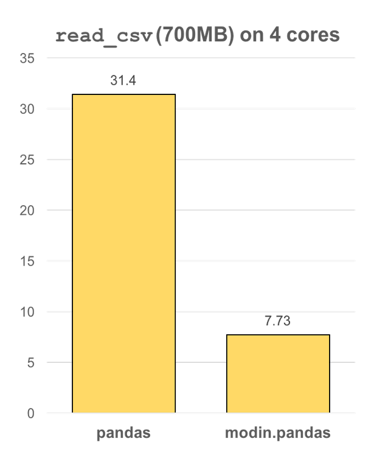
<br>
Fuente: [Repositorio proyecto Modin](https://github.com/modin-project/modin)

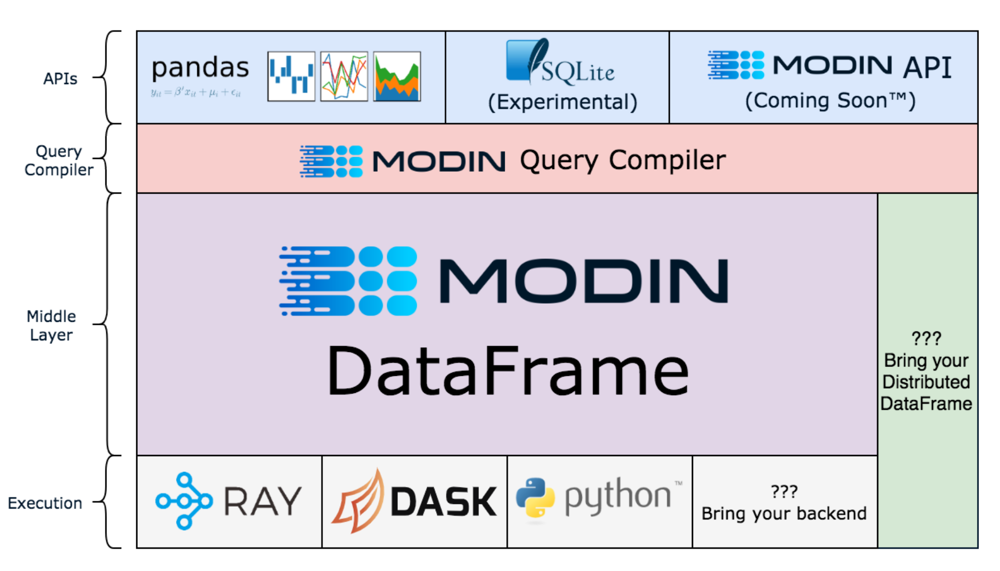
<br>
Fuente: [Repositorio proyecto Modin](https://github.com/modin-project/modin)

Para ocupar Modin necesitas instalarlo con `pip install "modin[all]"` (si estás en Windows -por qué!- deberá ser con `pip install "modin[dask]"`) en el ambiente de pyenv/virtualenv/anaconda/conda de la clase. Una vez instalado, necesitas definir qué *engine* ocuparás para que Modin se haga cargo del procesamiento en paralelo, hay 2 *engines*:
+ Ray
+ Dask

Si estas en Windows solo puedes ocupar Dask porque Ray no está soportado en Windows, si estas en Linux o Mac puedes seleccionar cualquier de las dos -selecciona Ray, Dask aún es experimental-.

Para definir el *engine* tendrás que poner el siguiente código **antes** de que importes la librería de modin.

```
import os

os.environ["MODIN_ENGINE"] = "ray"
# o bien
# os.environ["MODIN_ENGINE"] = "Dask"
```


 **sólo** necesitas importar la librería como `import modin.pandas as pd`, al ponerlo como pd, en todos los lugares donde ocupabas pandas ahora ocuparás Modin.

No todas las funciones de Pandas está implementadas en Modin aún, el estatus actual es el siguiente:

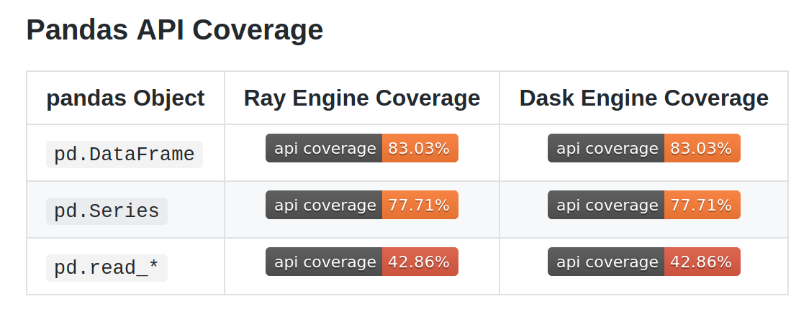
<br>
Fuente: [Repositorio proyecto Modin](https://github.com/modin-project/modin)

Por ejemplo, el verano pasado aún no se podían leer parquets desde Modin, ahora ya se puede :).

 Notebook `07_modin.ipynb`

### Referencias

- Documentación [Zeppelin 0.82](https://zeppelin.apache.org/docs/0.8.2/)
- Puertos de EMR [WebServices](https://docs.aws.amazon.com/emr/latest/ManagementGuide/emr-web-interfaces.html)
+ [API de SparkSQL](https://spark.apache.org/docs/2.4.4/api/python/index.html)
+ [Documentación para SQL, DataFrames y DataSets de Spark](https://spark.apache.org/docs/2.4.4/sql-programming-guide.html)
+ [Documentación general de Spark](https://spark.apache.org/docs/2.4.4/quick-start.html)
+ [Modin](https://github.com/modin-project/modin)
+ [API Reference Modin](https://modin.readthedocs.io/en/latest/index.html)
