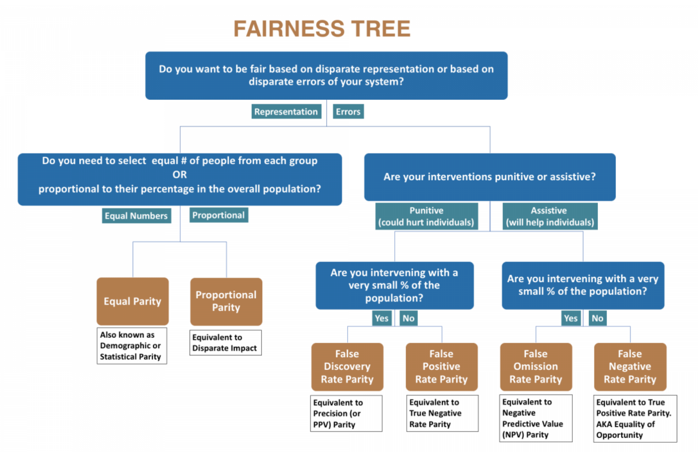
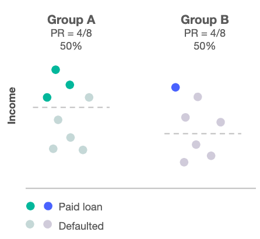
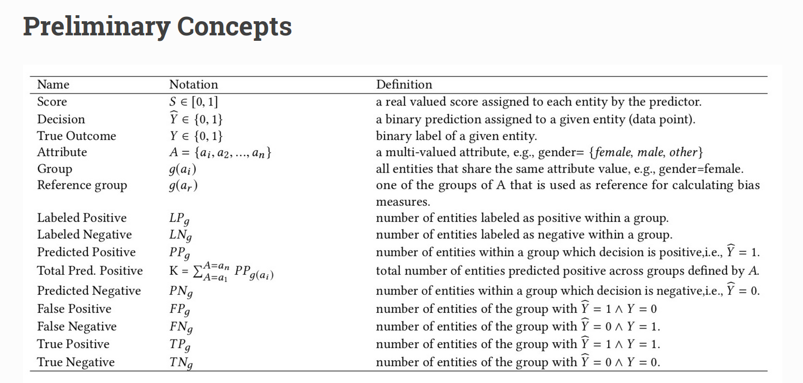
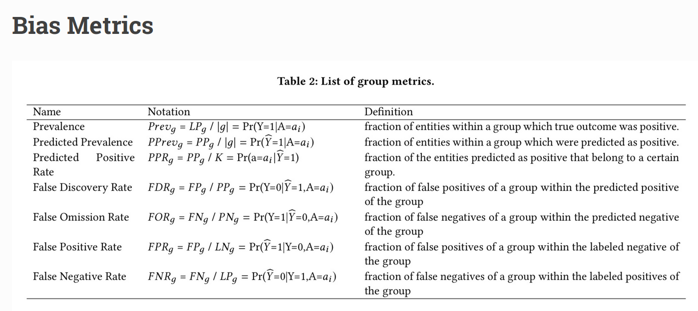
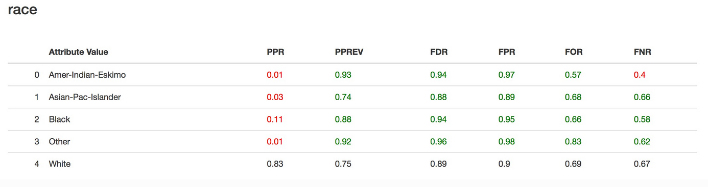
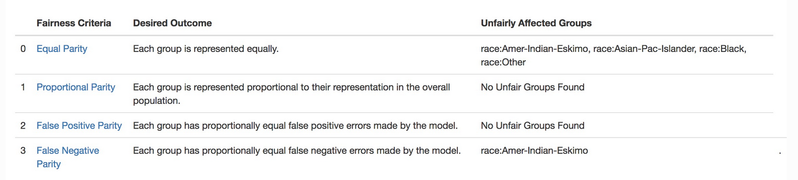
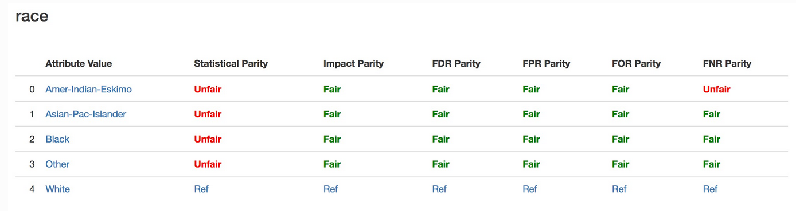
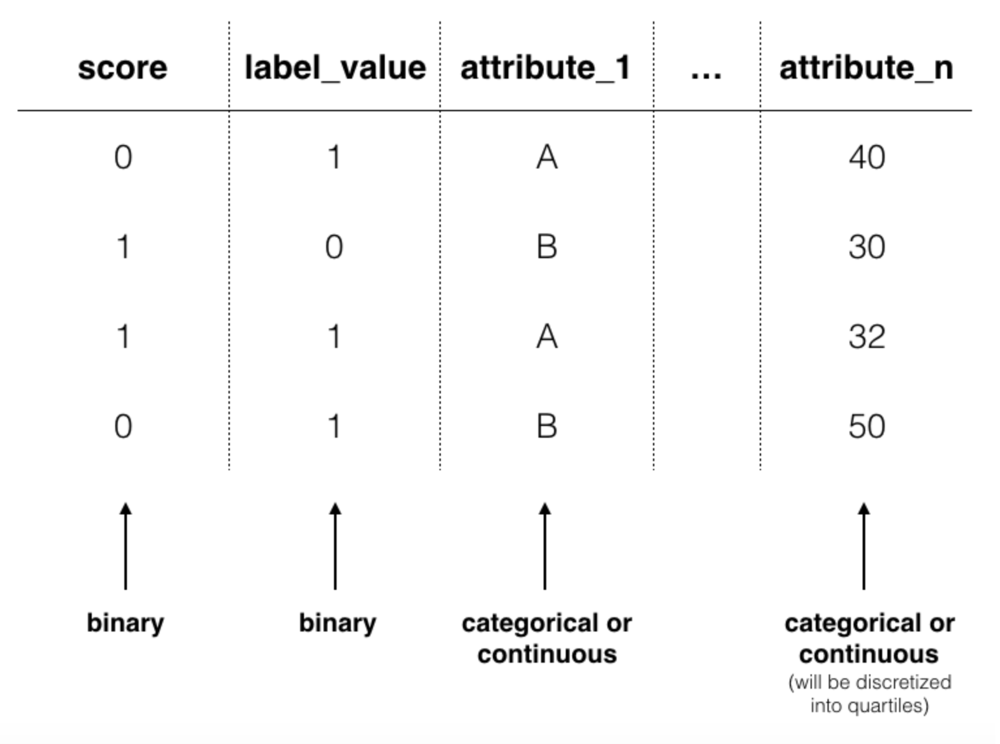
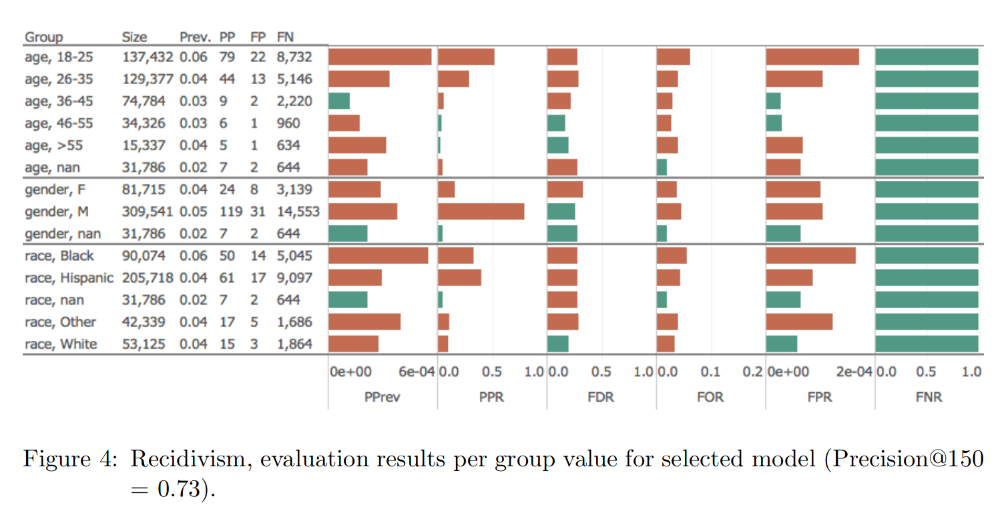

M. Sc. Liliana Millán Núñez liliana.millan@itam.mx

Abril 2020

## Bias and Fairness

### Agenda

+ Contexto
+ Aequitas
+ AIFairness360

### Contexto

*Machine Learning* por **naturaleza** es discriminante, pues justo lo que hacemos es discriminar datos a través del uso de la estadística. Sin embargo, esta discriminación puede ser un problema cuando brinda ventajas sistemáticas a grupos privilegiados y desventajas sistemáticas a grupos no privilegiados. Por ejemplo: Privilegiar la atención médica a pacientes blancos sobre pacientes afroamericanos. [A biased medical algorithm favored white people for health-care programs](https://www.technologyreview.com/2019/10/25/132184/a-biased-medical-algorithm-favored-white-people-for-healthcare-programs/).

Un sesgo en el set de entrenamiento ya sea por prejuicio o por un sobre/sub sampleo lleva a tener modelos con sesgo.

### Aequitas

Latín de equidad. Es un *toolkit open source* para medir *bias* y *fairness* desarrollado por [DSSG](http://www.dssgfellowship.org/).

El siguiente árbol de decisión está desarrollado pensando desde el punto de vista del tomador de decisiones -operativas- al que ayudamos desarrollando un modelo de *machine learning* para identificar en qué métricas deberíamos de concentrarnos para cuantificar el *bias* y *fairness*.

 
Fuente: [Versión anterior Aequitas](http://www.datasciencepublicpolicy.org/projects/aequitas/)

 
Fuente: [Versión actualizada Aequitas](http://www.datasciencepublicpolicy.org/projects/aequitas/)

Donde:

+ *Punitive*: Corresponde a modelos en donde al menos una de las acciones asociadas a nuestro modelo de predicción está relacionada con un "castigo". Por ejemplo: Algoritmos donde se predice la probabilidad de reincidencia en algún delito y que es tomada como variable para decidir si dan libertad provisional o no.

+ *Assistive*: Corresponde a modelos en donde la acción asociada al modelo son del estilo de triage. Por ejemplo: Priorización de inspecciones a realizar: médicas, a hogares, a *foster homes*, a estaciones de generación de energía, etc.  

 Rercordemos:

||Predicted|Real|
|:------|:-------|:-------|
|TP|1|1|
|FP|1|0|
|TN|0|0|
|FN|0|1|

Y que:

+ TPR = [0,1]
+ FPR = [0,1]
+ TNR = 1 - FPR
+ FNR = 1 - TPR

Además:

+ Precision: $\frac{TP}{TP+FP}$
+ Recall: $\frac{TP}{TP+FN}$

Ahora si...

1. *Equal Parity* o *Demographic or Statistical Parity*: Cuando nos interesa que cada grupo de la variable "protegida" -género- tenga la misma proporción de etiquetas positivas predichas (TP). Por ejemplo: En un modelo que predice si darte o no un crédito, nos gustaría que sin importar el género de la persona -*demographic parity*- tuvieran la misma oportunidad.

 
Fuente: [How to define fairness to detect and prevent discriminatory outcomes in Machine Learning](https://towardsdatascience.com/how-to-define-fairness-to-detect-and-prevent-discriminatory-outcomes-in-machine-learning-ef23fd408ef2)

Se utiliza esta métrica cuando:

a) Queremos cambiar el estado actual para "mejorarlo". Por ejemplo: Ver más personas de grupos desfavorecidos con mayor oportunidad de tener un préstamo.

b) Conocemos que hay habido una ventaja histórica que afecta los datos con los que construiremos el modelo.

##### *Caveats*

Al querer eliminar las desventajas podríamos poner en más desventaja al grupo que históricamente ha tenido desventaja, ya que no está preparado -literalmente- para recibir esa ventaja. Por ejemplo, si damos créditos a grupos a los que antes de hacer *fairness* no lo hacíamos, sin ninguna educación financiera o apoyo de educación financiera de nuestra parte, muy probablemente esas personas caerán en *default* aumentando el *bias* que ya teníamos inicialmente.

2. *False Positive Parity*: Cuando queremos que todos los grupos de la variable protegida tengan el mismo FPR. Es decir, nos equivocamos en las mismas proporciones para etiquetas positivas que eran negativas.

3. *False Negative Parity* o *Equal Oppportunity*:  Cuando queremos que todos los grupos tengan el mismo FNR -el mismo TPR-.

 
Fuente: [How to define fairness to detect and prevent discriminatory outcomes in Machine Learning](https://towardsdatascience.com/how-to-define-fairness-to-detect-and-prevent-discriminatory-outcomes-in-machine-learning-ef23fd408ef2)

Se utiliza esta métrica cuando:

a) El modelo necesita ser muy bueno en detectar la etiqueta positiva.

b) No hay -mucho- costo en introducir falsos negativos al sistema -tanto al usuario como a la empresa-. Por ejemplo: Generar FPs en tarjeta de crédito.

c) La definición de la variable *target* no es subjetiva. Por ejemplo: Fraude o No Fraude no es alog subjetivo, buen empleado o no puede ser muy subjetivo.

##### *Caveats*

Para poder cumplir con tener el mismo porcentaje de TPR en todos los grupos de la variable protegida, incurriremos en agregar más falsos positivos, lo que puede afectar más a ese grupo a largo plazo.

4. *Proportional Parity* o *Impact Parity* o *Minimizing Disparate Impact*: Cuando nos interesa que cada grupo de la variable "protegida" tenga el mismo impacto. Por ejemplo, en la imagen anterior de *False negative parity*, no se tiene el mismo *impact parity* pues en el grupo B el impacto resultante de tener la misma proporción de TPR introdujo muchos más FPs.

5. *False Omission Rate (FOR)*: Esta métrica está asociada a las etiquetas negativas. Se calcula como $\frac{FN}{FN+TN}$, y nos permite identificar la proporción de Falsos Negativos que existen entre todas las etiquetas predichas como negativas. Ocupamos esta métrica cuando nos interesa conocer si hay un sesgo hacia algún grupo de no ser selección como etiqueta positiva, por lo que se busca tener paridad entre los FNR de todos los grupos de la variable "protegida". Asociada a modelos *assistive*.

6. *False Discovery Rate (FDR)*: Esta métrica está asociada a las etiquetas positivas pero enfocadas a los False Positive. Se calcula como $\frac{FP}{FP+TP}$, y nos permite identificar la proporción de Falsos Positivos que existen entre todas las etiquetas predichas como positivas. Ocupamos esta métrica cuando nos interesa conocer si hay sesgo hacia un grupo para que salga FP. Asociada a modelos *punitive*.  

#### Conceptos preliminares para Aequitas

+ *Atrribute*: Un *feature* en nuestro *dataset*. Por ejemplo: `genero`.
+ *Group*: Un **grupo** está formado por las observaciones que tienen un valor espécifico del atributo. Por ejemplo: El grupo `genero-femenino`.
+ *Referenced group*:  Seleccionamos uno de los grupos que nos servirá como referencia. Existen 3 formas de seleccionar este grupo base:
  + El grupo de mayor tamaño entre todos los grupos existentes -de mayor elementos en él-. Por ejemplo: `genero-masculino`.
  + El grupo de menor tamaño. Por ejemplo: `genero-otro`.
  + Aquél que históricamente ha sido un grupo favorecido. Por ejemplo: Para la variable raza, el grupo `raza-blanca`.
+ *Labeled Positive*: El número de elementos etiquetados como positivo dentro de un grupo.
+ *Labeled Negative*: El número de elementos etiquetados como negativo dentro de un grupo.
+ *Predicted Positive (PP)*: Número de observaciones en un grupo con predicción de etiqueta positiva.
+ *Total predicted positive*: Número total de observaciones con predicción de etiqueta positiva en todos los grupos.
+ *Predicted Negative (PN)*: Número de observaciones en un grupo con predicción de etiqueta negativa.

 
Fuente: [Aequitas API](https://dssg.github.io/aequitas/metrics.html)

#### Métricas de distribución de grupos

En estas métricas nos interesa conocer las distribuciones de las observaciones en cada grupo de la variable "protegida".

1. *Prevalence*: La fracción de observaciones en un grupo cuya predicción fue TP.
2. *Predicted Prevalence (PPrev)*: La fracción de observaciones en un grupo con predicción de etiqueta positiva.
3. *Predicted Positive Rate (PPR)*: La fracción de observaciones con predicción de etiqueta positiva que pertenecen a cierto grupo.

 
Fuente: [Aequitas API](https://dssg.github.io/aequitas/metrics.html)

#### Métricas de error de grupos

En estas métricas requerimos de la verdadera etiqueta para encontrar los TP, FP, TN y FN. A través de estas medidas podemos obtener las siguientes 4 métricas asociadas al error:

1. *False Discovery Rate (FDR)*: $FDR=\frac{FP}{FP+TP}$ La fracción de falsos positivos en un grupo de aquellos predichos como positivos del mismo grupo.
2. *False Omission Rate (FOR)*: $FOR=\frac{FN}{FN+TN}$ La fracción de falsos negativos de un grupo de aquellos predichos como negativos en el grupo.
3. *False Positive Rate (FPR)*: La fracción de falsos positivos de un grupo de los etiquetados como negativos en el grupo.
4. *False Negative Rate (FNR)*: La fracción de falsos negativos de un grupo de los etiquetados como positivos en el grupo.

#### Cálculo de *bias* y *fairness*

En este *framework* se define *bias* como una métrica de disparidad entre los valores obtenidos para las métricas de un grupo y el grupo de referencia.

**Proceso General:**

1. Seleccionar los grupos que serán referencia para cada variable "protegida".
2. Calcular las métricas de *fairness* de interés: PPR, PPrev, FDR, FPR, FOR, FNR.
3. Calcular *disparity* y *bias* entre los diferentes grupos y el grupo referencia.
4. Obtener el *fairness criteria assessment* de cada grupo (nosotros definimos el *threshold*).

**Detalles de implementación:**

Antes que nada, seleccionamos el grupo de referencia -con la metodología deseada-.

Las diferentes métricas de *fairness* se aplican comparando pares de grupos definidos por un atributo dado. Por ejemplo: El *Predicted Prevalence Disparity* se obtiene al dividir el *Predicted Prevalence* del grupo `genero femenino` y el *Predicted Prevalence* del grupo `genero` de referencia.

1. Calcular las métricas por grupo
  + *Predicted Positive Rate*
  + *Predicted Prevalence*
  + *False Discovery Rate*
  + *False Positive Rate*
  + *False Omission Rate*
  + *False Negative Rate*

 
Fuente: [Aequitas API](https://dssg.github.io/aequitas/metrics.html)

2. Calcular *disparity* y *bias*
+ Para cada grupo, dividir entre el grupo de referencia de la misma métrica para obtener *parity*.

**Métricas de bias**

+ *Equal Parity*
+ *Proportional Parity*
+ *False Positive Parity*
+ *False Negative Parity*
+ ...

En el reporte de Aequitas, un modelo es *fair* **si y solo si** todas las métricas de interés calculadas son *fair*, si alguna es *unfair* el modelo completo se considera *unfair*.

 
Fuente: [Aequitas API](https://dssg.github.io/aequitas/metrics.html)

 
Fuente: [Aequitas API](https://dssg.github.io/aequitas/metrics.html)

3. Obtener el *fairness criteria assessment*

$$(1-\tau) \le \text{DisparityMeasure}_{group_i} \le \frac{1}{(1-\tau)}$$

Donde $\tau$ es el *fairness threshold* definido por nosotros. En el siguiente ejemplo, $\tau=20%$ por lo que cualquier métrica de paridad que se encuentre entre 0.8 y 1.25 va a ser tratado como *fair*.

 
Fuente: [Aequitas API](https://dssg.github.io/aequitas/metrics.html)

Finalmente, para calcular todas estas métricas y ocupar Aequitas, debemos tener los datos en el siguiente formato:

+ `score`: Predicción generada por el modelo que queremos auditar.
+ `label_value`: La etiqueta real asociada a la observación.
+ columnas de cada atributo que queremos auditar por *bias* -la variable protegida-: edad, sexo, raza, ciudadanía, estatus civil, tipo de ciudadanía, etc.

 
Fuente: [Aequitas](http://aequitas.dssg.io/upload.html)

Ejemplo: *Compas Analysis using Aequitas*.

Para ocupar Aequitas con Python necesitamos interactuar con 3 grandes clases:
+ `Group()`
+ `Bias()`
+ `Fairness()`

[Compas Analysis using Aequitas Python](https://dssg.github.io/aequitas/examples/compas_demo.html)

 
Fuente: [Aequitas: A Bias and Fairness Audit Toolkit](https://arxiv.org/pdf/1811.05577.pdf)

### AIFairness360 (AIF360)

*Open source toolkit* de IBM que reune diferentes algoritmos para mitigar el *bias* y *fairness* en diferentes etapas del modelado, así como métricas para identificarlos. Todo está hecho en Python.

A diferencia de Aequitas que **cuantifica** y **transparenta** el *bias* y *fairness*, esta herramienta **mitiga** el *bias*.

#### Algoritmos de mitigación de sesgo

Estos algoritmos buscan mitigar el sesgo modificando los datos de entrenamiento -*pre-processing*-, el modelo -*in-processing*-, o bien las predicciones emitidas por un modelo -*post-processing*.

La selección del algoritmo depende en gran medida de si podemos o no hacer modificaciones en esa etapa del *machine learning pipeline*. Si podemos tener acceso desde modificar los datos de entrenamiento, entonces es mejor hacerlo aquí-*pre-processing*-.

 ¿En qué situación te imaginas que como científicos de datos solo para poder aplicar un algoritmo de mitigación en la parte de *post-processing*?

##### Pre-processing

+ *Disparate Impact Remover*. Del paper [Certifying and removing disparate impact](https://arxiv.org/pdf/1412.3756.pdf)
+ *Learning Fare Representations*. Del paper [Learning Fair Reperesentations](https://www.cs.toronto.edu/~toni/Papers/icml-final.pdf)
+ *Reweighing*. Del paper [Data preprocessing techniques for classification without discrimination](https://core.ac.uk/download/pdf/81728147.pdf)
+ *Optimized Pre-Processing*. Del paper [Optimized Pre-processing for Discrimination Prevention](https://krvarshney.github.io/pubs/CalmonWVRV_nips2017.pdf)

##### In-Processing

+ *Adversarial Debiasing*. Del paper [Mitigating Unwanted Biases with Adversarial Learning](http://m-mitchell.com/papers/Adversarial_Bias_Mitigation.pdf)
+ *ART Classifier*
+ *Meta Fair Classifier*. Del paper [Classification with Fairness Constraints: A Meta-Algorithm with Provable Guarantees](https://arxiv.org/pdf/1806.06055.pdf)
+ *Prejudice Remover*. Del paper [Fairness-Aware Classifier with Prejudice Remover Regularizer](http://citeseerx.ist.psu.edu/viewdoc/download?doi=10.1.1.297.566&rep=rep1&type=pdf)

##### Post-processing

+ *Calibrated equality of Odds*. Del paper [On Fairness and Calibration](https://papers.nips.cc/paper/7151-on-fairness-and-calibration.pdf)
+ *Equality of Odds*. Del paper [Equality of Opportunity in Supervised Learning](https://papers.nips.cc/paper/6374-equality-of-opportunity-in-supervised-learning.pdf)
+ *Reject Opinion Based Classification*. Del paper [Decision Theory for Discrimination-Aware Classification](https://mine.kaust.edu.sa/Documents/papers/ICDM_2012.pdf)

### Referencias

+ [Aequitas toolkit](http://aequitas.dssg.io/)
+ [Aequitas Documentation](https://dssg.github.io/aequitas/)
+ Paper [Aequitas: A Bias and Fairness Audit Tookit](https://arxiv.org/pdf/1811.05577.pdf)
+ [Aequitas, understandig the metrics](https://dssg.github.io/aequitas/metrics.html)
+ [Aequitas API](https://dssg.github.io/aequitas/metrics.html)
+ [Aequitas with Python](https://dssg.github.io/aequitas/using_python.html)
+ [AI Fairness 360](https://aif360.mybluemix.net/)
+ [AI Fairness 360 API](https://aif360.readthedocs.io/en/latest/)
