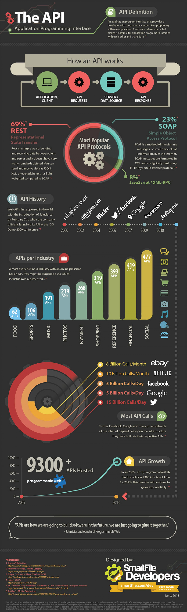

M. Sc. Liliana Millán Núñez liliana.millan@itam.mx

Abril 2021

## Deployment

### Agenda

+ SFTP
+ API
  + Flask
+ Dashboard

### SFTP

Acrónimo de *Secure File Transfer Protocol*. Este tipo de *delivery* implica que tenemos que depositar un archivo (normalmente csv) en un servidor remoto en un lugar particular las predicciones cada $x$ tiempo.

Si esta es la forma de entrega recuerda establecer un estándar en el nombre de los archivos para que sea muy claro qué se entregó cuándo. Por ejemplo, si estas entregando las predicciones de quién hará churn en esta semana, el nombre debería quedar algo asi: `churn_20200501_predictions.csv`.

Para que esto funcione previamente se deberá haber definido junto con el cliente el formato y tipo de datos que van en el csv para que no se modifique.

```
## Rob notes
- Esta es una salida un poco chafa porque no está incorporado en el flujo.
- Esto es latoso porque hay que poner muchas convenciones.
- Con esta forma de entrega nos "lavamos las manos". 
```

### API

Acrónimo de *Application Programming Interface*. Un(a) API nos permite comunicar dos componentes o sistemas de forma programática. O bien, interactuar con un sistema o componente de forma programática. Este sistema o componente puede ser una empresa, un módulo, un sistema, una ONG, etc.

Por ejemplo: La mayoría sus proyectos utilizan una API a través de la cuál obtienen los datos que necesitan para sus productos de datos.

 Te recomiendo leer un pequeño [artículo de Forbes]((https://www.forbes.com/sites/tomtaulli/2020/01/18/api-economy--is-it-the-next-big-thing/#22c51ef642ff)) de enero de 2020 donde se habla de la economía que está generando el desarrollo de APIs.

 La forma más eficiente de integrar nuestro trabajo como científicos de datos a una empresa/proceso es utilizar una API para "exponer" las predicciones de nuestro modelo. De esta manera, el área de sistemas "solo" tiene que hacer una petición a la API para obtener los resultados del modelo.

También preferimos ocupar APIs porque de esta manera nos aseguramos que el desarrollo o implementación de los modelos están bien hechos -los hicimos nosotros con nuestras herramientas de trabajo: R, Sklearn, PySpark, etc.- y que no hubo ningún cambio en el código que pueda ser problema. --> ¡No queremos que ingenieros de *software* implementen nuestra solución!.

```
## Rob notes
- Con esto podemos evitar conectarnos al sistema de la otra persona.
- A TI no le interesa nuestro modelo.
- API es la mejor manera de entregar resultados.
  - Obligamos al cliente a que jale información.
```

#### Protocolos para API

+ `SOAP`: Acrónimo de *Simple Object Access Protocol*, en este protocolo el intercambio de datos se realiza a través de mensajes a través de Internet. Los mensajes SOAP están en formato XML y se utilizan sobre métodos de `HTTP`: `POST`, `PUT`, `GET`, `DELETE`, `HEAD`.  

+ `REST`: Acrónimo de *Representational State Transfer*, en este protocolo también conocido como *RESTful* el intercambio de datos se realiza entre servidor y cliente y hay varios formatos de entrega: JSON, XML, texto plano, etc., aunque el más utilizado es JSON. Dado que no hay un formato estándar, es más flexible que el protocolo SOAP y por lo tanto más utilizado, en un estudio del 2017, 81% de los APIs hosteados por [Programmingweb](https://www.programmableweb.com/news/which-api-types-and-architectural-styles-are-most-used/research/2017/11/26) eran `REST` vs 9% `SOAP`.

Cabe mencionar que el protocolo SOAP aún es muy utilizado en empresas financieras donde la comunicación entre intra sistemas legacy se realiza a través del protocolo SOAP.

El protocolo REST, también ocupa los métodos de `HTTP` para la transferencia de datos: `PUT`, `POST`, `GET`, etc.

+ Otros como `GraphQL` que empieza a tener cierta popularidad (desarrollada por Facebook).

```
## Rob notes
- El SOAP es muy viejito.
  - Se usa en sistemas legacy (viejitos y obsoletos)
- REST es lo más popular hoy.
```

#### Historia

Los API como tal existen desde el año 2000 y en los primeros 10 años, eran las grandes empresas las que tenían API como SalesForce, Amazon, Flickr, Facebook, Google, Foursquare, Instagram.

Hoy en día hay APIs en casi todos los sectores de la industria.

Desde 2014 las API correspondientes a servicios de datos, financieros, analítica han ido en aunmeto.

El top 5 para 2019: Facebook, Google maps, Twitter, YouTube, Accuweather.

Por lo pronto estamos a punto de llegar al **Trillón** de *endpoints*! (Dell Technologies Capital).


<br>
Fuente: SmartFiles Developers, Junio 2013.

#### HTTP Methods

También conocidos como verbos, cada uno de estos métodos tiene un estatus de respuesta específico. Por ejemplo, el famoso 404 (Not Found) de cuando no encuentras una página -o recurso- es un posible estatus correspondiente a haber hecho un método POST o GET o PUT o DELETE.  

+ POST: Corresponde a una operación Create, se utiliza para crear nuevos recursos o exponer nuevos recursos.
+ GET: Corresponde a una operación Read, se utiliza para leer un recurso, este recurso se regresa en un formato de XML o JSON.
+ PUT: Corresponde a una operación Update, se utliza para que el recurso existente ahora tenga una actualización. También es posible que esta operación pueda Crear un recurso si la URI que se envía desde el cliente no existe.
+ DELETE: Corresponde a una operación Delete, se utiliza para eliminar un recurso existente.

|Método|Estatus OK|Estatus no OK|
|:----------|:-------------|:-----------|
|POST|201 (CREATED)|404 (NOT FOUND)<br>409 (BAD CONFLICT) el recurso ya existe|
|GET|200 (OK)|404 (NOT FOUND)<br>400 (BAD REQUEST)|
|PUT|200 (OK)<br> 201 si se creó|204 (NO CONTENT)<br>404 (NOT FOUND)|
|DELETE|200 (OK)|404 (NOT FOUND)|

```
## Rob notes
- Nosotros casi que solo vamos a usar "GET".
```


#### Frameworks para API

Existen varios *frameworks* para desarrollar una API, en particular para python hay varias opciones: Flask, Bottle, Django, entre otros.

Ocuparemos Flask porque es muy sencillo de implementar y trae lo mínimo necesario para hacer una API por lo que si necesitamos más cosas necesitaremos agregar extensiones a Flask (de Flask) o bien si ya te sientes con más confianza a conceptos de ingeniería de software pasarnos a Django.

Si en tu equipo de trabajo hay un ingenieró de datos entonces la opción uno debería ser Django que trae todo lo que pudieras necesitar: seguridad en las llamdas, soporte para aguantar `n` llamadas por segundo, tiempo de respuesta, etc.

```
## Rob notes
- Flask es una solución eficiente y rápida para hacer prototipo de APIs.
- Django es un framework muy robusto para funcionalidades complejas.
  - Puedes agregar seguridad por ejemplo.
- El servicio de AWS te hace las cosas más fáciles
  - Solo hay que mandarle datos para que los exponga.
  - Maneja todo por ti.
```


##### Flask

Es un *micro-framework* para APIs escrito en Python. Para instalarlo únicamente requieres bajarlo con pip `pip install flask` en tu ambiente virtual de la clase.

Para utilizar Flask ocuparemos decoradores que nos permitarán "exponer" funciones a través de una API.

El decorador más utilizado es `route` y nos permite definir la ruta a través de la cuál ese servicio quedará expuesto, esta ruta también se puede armar dinámicamente pasando parámetros en la URL utilizando `<variable>`, y también es posible definir el tipo de dato que esta variable debe ser, por ejemplo: `<string: variable>`.

Los tipos soportados por Flask son:
+ `string` el de *default* si no se define un tipo  
+ `int` acepta enteros positivos  
+ `float` acepta reales positivos
+ `path` como un `string` pero acepta los `\`
+ `uuid` acepta `strings` UUID.

Es posible agregar los métodos que cada *endpoint* resuelve, agregándolos al decorador `route`.

 Ir al *script* `flask_script_1.py`.

Para levantar el servidor de Flask necesitamos definir como variable de ambiente dónde está la clase que implementa Flask. `$ export FLASK_APP=script_python.py` o el directorio que tiene los *scripts* que definen el *routing* y los servicios a exponer.

Después solo se necesita correr flask `flask run`, esto levantará un pequeño servidor que expone a través de tu localhost en el puerto 5000 (por default).  


##### Swagger UI

Es un *framework* que nos permite documentar APIs, de esta manera exponemos a posibles usuarios de nuestra API cómo interactuar con ella. Listar los servicios disponibles, a los que llamamos *endpoints*, y las firmas de los métodos que se pueden ocupar.

Por ejemplo: [Petstore demo](https://petstore.swagger.io/)

Para ocupar Swagger con Flask necesitamos instalar la extensión de Flask `Flask-RESTPlus` con `pip install flask-restplus`.

Al utilizar Flask-RESTPlus ahora tenemos que hacer clases que implementan a la clase `Resource`, en nuestras clases debemos implementar los métodos HTTP que queremos que el *endpoint* administre.

 Verificar el script `flask_w_swagger.py`.

Esto solo es la base de APIs, a esta base falta agregarle autenticación, seguridad (tokens) y administración de la API. Se pueden ir agregando extensiones a Flask para ir agregando cada uno de estos puntos.

#### API Management

Todas las plataformas de nube tienen una solución para crear y administrar APIs, la de AWS se llama *Amazon API Gateway*.


<br>
Fuente: [AWS API Management](https://aws.amazon.com/api-gateway/api-management/)

### Dashboards

**Python**

#### Bokeh

Librería de visualización interactiva de Python. Supuestamente permite tener un alto performance interactivo sobre grandes cantidades de datos e inclusive sobre *streamang*.

Bokeh se puede utilizar para graficas interactivas, *dashboards*, y aplicaciones de datos.

Para instalar Bokeh solo necesitas poner `pip install bokeh` en el pyenv/virtualenv/conda de la clase. A través de pip no se instalan los ejemplos, pero puedes verlos en el [repositorio](https://github.com/bokeh/bokeh).

**Características**

+ Utiliza el framework de D3 para *front* y Tornado para *back* (WebServer en Python)
+ Se puede ocupar en Jupyter notebooks y Zeppelin
+ Para algunas gráficas se require de conocer Javascript (╯°□°)╯︵ ┻━┻
+ Es posible tener casos de inconsitencia de interacción en *dashboards*: Se seleccionan opciones del dashboard que no actualizan las gráficas o muestran datos que no debería
+ Para enero del 2018 parece que Dash es más eficiente cuando se tienen grandes cantidades de datos
+ En general parece que el sentimiento es que Bokeh es más difícil que Dash y que es menos intuitivo
+ Mantenimiento por Anaconda
+ De licencia abierta

#### Dash

Para instalarlo solo necesitas poner `pip install dash` en el pyenv/virtualenv/conda de la clase.

Levanta un pequeño servidor que corre tu aplicación (como Shiny).

+ Utiliza framewokrs de React y Plotly para el *front* y *Flask* para el *back*
+ No se puede ocupar en Jupyter notebooks o Zeppelin
+ Solo se requiere saber Python
+ No se conocen de casos con inconsistencia de interacción, o por lo menos no se ha reportado
+ Con gran cantidad de datos o *streaming* no se ve afectado el *performance*
+ Mantenimiento por Plotly
+ De licencia abierta

[Ejemplos de Dash dashboards](https://dash-gallery.plotly.host/Portal/)

**R**

#### R-Shiny

Ya tiene un tiempo que R-Shiny agregó *dashboards* a su conjunto de herramientas de visualización.

Ahora tienen una opción muy sencilla que te permite hacer *dashobards*, el paquete `flexdashboard`.

Este paquete te permite utilizar un Rmd como fuente, basta con ponerle al *header* del Rmd que la salida sea un `flexdashboard::flex_dashboard`. Cada elemento que tenga un *markdown header* de tres niveles `###` será interpretado como una sección que será agregada al *dashboard*, claro, tiene que tener un chunck de código de r con la visualización a mostrar!.

También exite la solución clásica de *dashboard*, en ésta si es necesario poner componentes UI de Shiny.    

+ Hecho en R
+ Mantenimiento por RStudio
+ Se requiere de pagar para poder tener usuarios concurrentes

[Ejemplos de *flexdashboard*](https://rmarkdown.rstudio.com/flexdashboard/examples.html)

#### Dash

### Referencias

+ [API Best practices](https://stoplight.io/blog/rest-api-standards-do-they-even-exist/)
+ [Forbes: API Economy](https://www.forbes.com/sites/tomtaulli/2020/01/18/api-economy--is-it-the-next-big-thing/#22c51ef642ff)
+ [Flask Documentación](https://flask.palletsprojects.com/en/1.1.x/)
+ [Flask API Reference](https://flask.palletsprojects.com/en/1.1.x/#api-reference)
+ [Swagger UI](https://swagger.io/tools/swagger-ui/)
+ [Flask-RESTPlus Documentación](https://flask-restplus.readthedocs.io/en/stable/)
+ [Bokeh](https://docs.bokeh.org/en/latest/index.html)
+ [Bokeh Quickstart](https://docs.bokeh.org/en/latest/docs/user_guide/quickstart.html)
+ [Tutorial Bokeh 5 minutos](https://nbviewer.jupyter.org/github/bokeh/bokeh-notebooks/blob/master/quickstart/quickstart.ipynb)
+ [Dash plotly](https://plotly.com/dash/)
+ [Dash tutorial](http://dash.plotly.com/)
+ [Dash gallery](https://dash-gallery.plotly.host/Portal/)
+ [Dash vs Bokeh](https://medium.com/sicara/bokeh-dash-best-dashboard-framework-python-shiny-alternative-c5b576375f7f)
+ [Shiny tutorial](https://shiny.rstudio.com/tutorial/)
