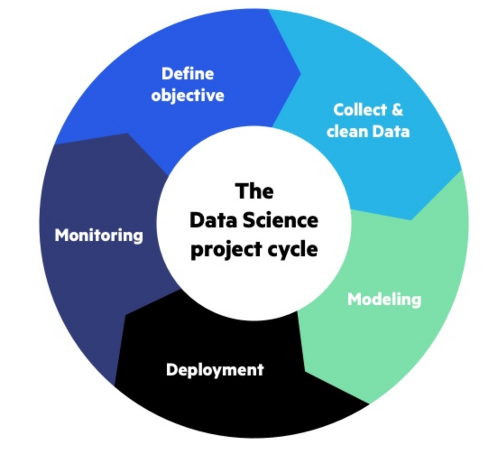

M. Sc. Liliana Millán Núñez liliana.millan@itam.mx

Mayo 2020

## Monitoreo de modelos

### Agenda
+ Monitoreo de modelos
+ Soluciones existentes
+ Dudas

### Monitoreo de modelos

¿A qué nos referimos cuando hablamos de monitoreo de modelos?

 
Fuente: [Deployment isn't the final step-Monitoring machine learning models in production blog](https://www.imperva.com/blog/deployment-isnt-the-final-step-monitoring-machine-learning-models-in-production/)

Esa sección de monitoreo casi **nadie** la hace... (╯°□°)╯︵ ┻━┻

El monitoreo sucede cuando El Modelo ya se encuentra en producción -aunque sea en prueba piloto-.

### Soluciones existentes

+ DataRobot (ahora \+ ParallelM)

+ AWS SageMaker Model Monitoring
