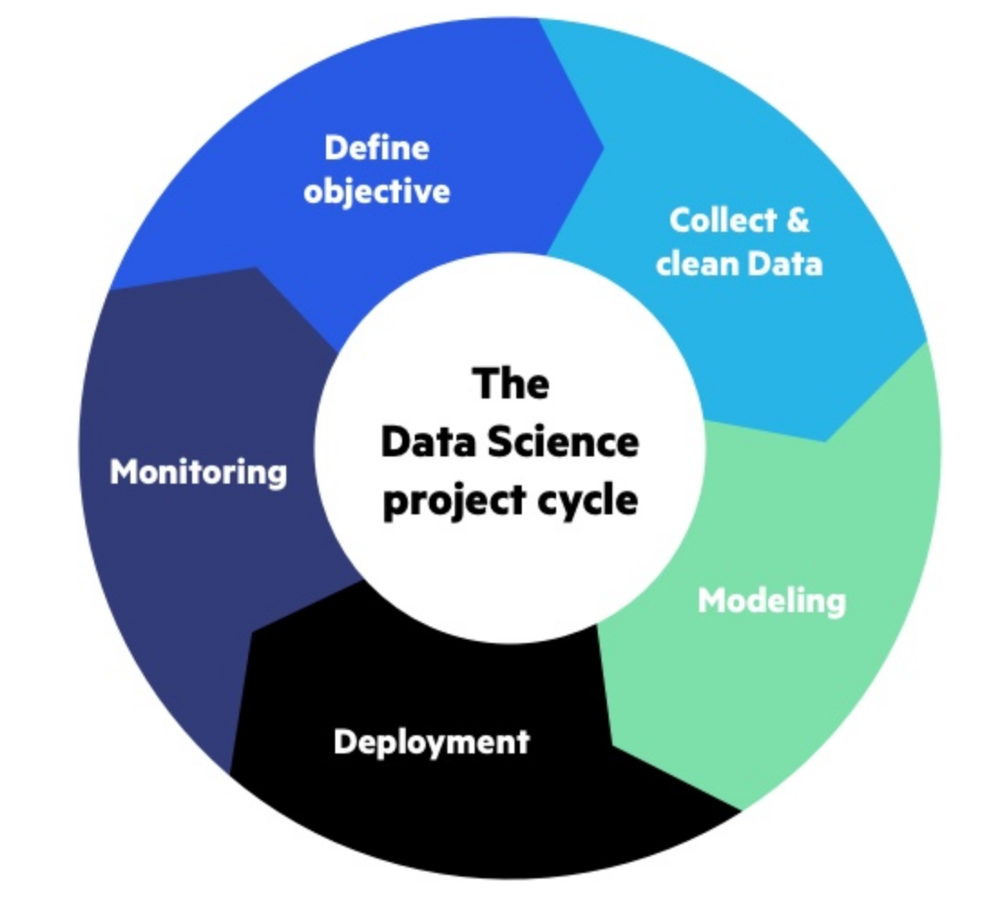
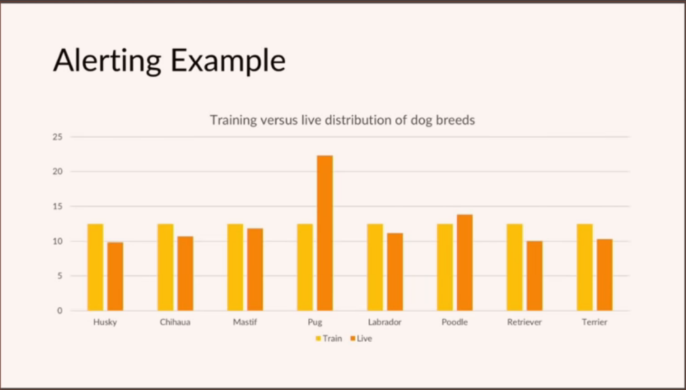
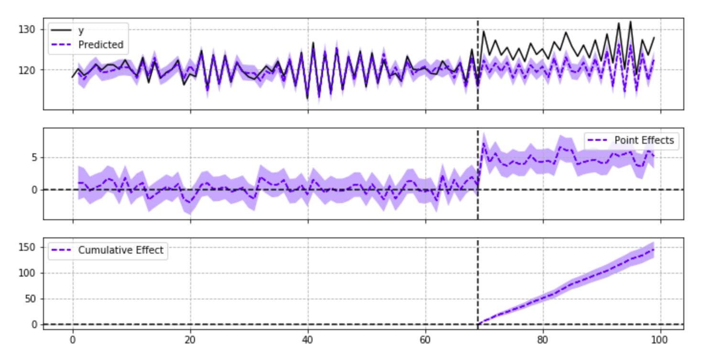
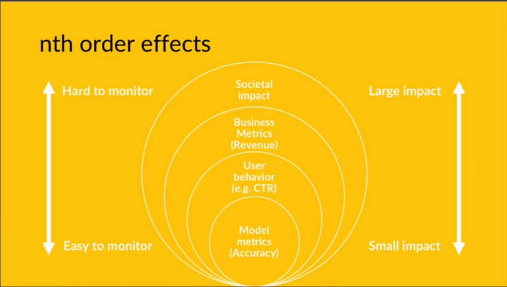
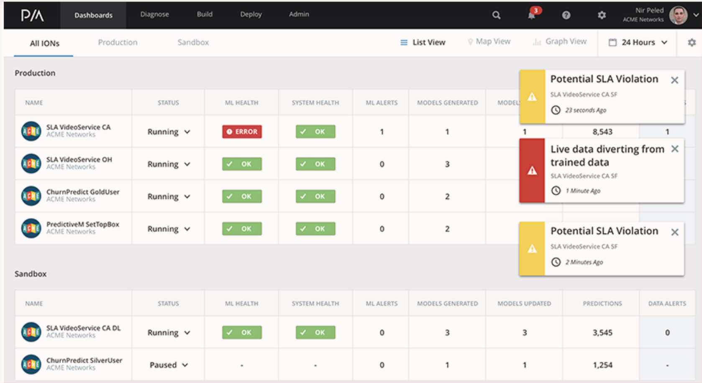

M. Sc. Liliana Millán Núñez liliana.millan@itam.mx

Mayo 2021

## Monitoreo de modelos

### Agenda
+ Monitoreo de modelos
+ Soluciones existentes
+ Dudas

### Monitoreo de modelos
```
## Rob Notes
- Podemos hacer un README.md por cada sección del modelo.
- Airflow te puede mostrar tu pipeline y tasks.
- Se puede usar gliphy (es un add de google chrome).
```

¿A qué nos referimos cuando hablamos de monitoreo de modelos?


<br>
Fuente: [Deployment isn't the final step-Monitoring machine learning models in production blog](https://www.imperva.com/blog/deployment-isnt-the-final-step-monitoring-machine-learning-models-in-production/)

Esa sección de monitoreo casi **nadie** la hace... (╯°□°)╯︵ ┻━┻

El monitoreo sucede cuando "El Modelo" ya se encuentra en producción -aunque sea en prueba piloto-.

Lo monitoreamos porque los modelos forman parte de un sistema dinámico, si hicimos bien nuestro trabajo los patrones con los que entrenamos el modelo se irán modificando en el tiempo, tenemos que estar pendientes de cómo está el desempeño de nuestro modelo para adecuarnos.

> En particuar en *machine learning* los datos no son algo estático -o muy pocas veces lo son-, se van modificando conforme pasa el tiempo.

**Concept Drift:** En *machine learning* este concepto se refiere a identificar el cambio entre los datos de entrada y la salida con el paso del tiempo.

```
## Rob Notes
- data drift se refiere a como van evolucionando los datos.
```

> "In most challenging data analysis applications, data evolve over time and must be analyzed in near real time. Patterns and relations in such data often evolve over time, thus, models built for analyzing such data quickly become obsolete over time. In machine learning and data mining this phenomenon is referred to as concept drift."

[An overview of concept drift applications](https://www.win.tue.nl/~mpechen/publications/pubs/CD_applications15.pdf)

¿Cómo monitoreamos modelos?

+ Identificar *data drift*. Esto es, cambios drásticos en los datos de entrada a tus modelos que provocan que el desempeño de tu modelo se degrade considerablemente. <- Nos protegimos también con validaciones a través de marbles en nuestro pipeline! ┌(° ͜ʖ͡°)┘
  + Comparar las distribuciones de los datos de entrada con las distribuciones del *dataset* de entrenamiento ocupado en el modelo. <- Para esto se tiene que tener en algún lugar guardado esta base de comparación. Por eso necesitamos la metadata del modelo que quedó seleccionado.
  + Generar alertas cuando las distribuciones tengan n desviaciones estándar
+ Distribución de las etiquetas \*


<br>
Fuente: [Monitoring models in production, PyData Amsterdam 2018](https://www.youtube.com/watch?v=IqKunD0Bl5c)

+ Distribución de los scores  
+ Distribución de cada variable
+ Estadística de cada variable: promedios, mediana, cuartiles, desviaciones estándar, correlaciones.
  + Si por ejemplo el dataset es de imágenes, texto o sonido: El tamaño de los archivos, calidad de la imágen, formato de persistencia, etc.
+ Si tienes un modelo supervisado, siempre generar un modelo de interpretabilidad de cada predicción. Eso nos puede dar *insights*.
+ Comparar contra la etiqueta real -> aunque esto puede tardar días, semanas, meses inclusive años dependiendo del problema. Si no existe tal cosa, nosotros podemos etiquetar un pequeño subset, eso nos ayudará a tener mayor contexto sobre el problema. Puede ser que algunas suposiciones que teníamos del problema y de los datos no se cumplan y haciendo este ejercicio ayuda a identificar esto rápidamente.
+ En casos donde no se trata de aprendizaje supervisado también puedes hacer verificaciones. Por ejemplo: Número de elementos en los clusters.
+ De ser posible habilita una forma en la que el *feedback* del usuario final te llegue.
+ Generar modelos de identificación de anomalías
+ Generar modelos de "impacto causal" [CausalImpact Python](https://github.com/dafiti/causalimpact)


<br>
Fuente: [CausalImpact Python](https://github.com/dafiti/causalimpact)

+ *Canary deployment*. Despliegue de un modelo -supuestamente mejor- a solo una pequeña proporción de usuarios. Este despliegue sucede a lo más por un par de horas -depende del problema y ciclo de negocio- y la idea es identificar si hay fallas en el producto, de haberlas se quita la versión nueva desplegada y se mantiene la versión actual.

 ¿Por qué crees que se llama *Canary Deployment*?


<br>
Fuente: [Monitoring models in production, PyData Amsterdam 2018](https://www.youtube.com/watch?v=IqKunD0Bl5c)

\* Para comparar distribuciones puedes ocupar la métrica de **Kullback-Leibler Divergence**, que cuantifica la disimilitud entre dos distribuciones, cuánto difieren dos distribuciones de probabilidad. SciPy tiene una función para esta métrica [entropy](https://docs.scipy.org/doc/scipy/reference/generated/scipy.stats.entropy.html). Recuerda que en entropía 0 significa homogeneidad!.

### Soluciones existentes

+ *Data Drift*: Azure Machine Learning

Para identificar *data drift* Azure genera un modelo de *machine learning* que identifica diferencias entre el dataset utilizado para el entrenamiento de un modelo y un dataset ocupado en algún deployment -datos reales una vez que está en producción-, el desempeño del modelo se convierte en el *drift coefficient* para cuantificar el *drift* entre los dos modelos. Luego usan un modelo de interpretabilidad (SHAP) para identificar cuáles son las variables que causan el *drift* -que más aportan al *drift coefficient*.  

+ AWS SageMaker Model Monitoring

Brinda monitoreo automático a modelos en producción, enviando alertas cuando la calidad de los datos se degrada.

Al igual que Azure ocupa el set de datos con el que se entrenó el modelo que está en producción y una fracción de datos nuevos que están llegando al modelo en producción. A través del servicio de *model monitoring* se infieren el esquema y tipo de datos, y se calculan estadísticas de los datos utilizando [Deequ](https://github.com/awslabs/deequ) -pruebas unitarias a los datos!-.

*Model Monitoring* genera un reporte que deposita en S3 cada "X" tiempo -tu lo configuras- que verifica la calidad de las predicciones y las características estadísticas y de esquema antes mencionadas para datos "nuevos". También se incluyen en el reporte violaciones, si es que hubo alguna.

Utiliza estas métricas para conectarlas con *AWS Cloud Watch* -monitoreo de infraestructura-, y poder configurar alertas específicas y generar *dashboards*.

[Aquí](https://aws.amazon.com/blogs/aws/amazon-sagemaker-model-monitor-fully-managed-automatic-monitoring-for-your-machine-learning-models/) hay un ejemplo para detalles de implementación. Claro que el modelo está implementado usando SageMaker... cada vez es más difícil salir del ecosistema de AWS!.

+ DataRobot (ahora \+ ParallelM)

Esta solución (MCenter) te permite deployar, monitorear y gobernar modelos en producción.

En la parte de monitoreo se generar alertas que permiten identificar cuando un modelo no tiene el desempeño esperado debido a cambios en los datos -*data drift*.

Al igual que en el resto de las soluciones utiliza el set de entrenamiento como *baseline* y datos nuevos que llegan de producción para hacer comparaciones e identificar *drift*. También utiliza el concepto de *canary model* para ir comparando las predicciones del modelo en predicción contral el mejor predecesor, o el mejor en *desarrollo*. El modelo que pones en producción es el *canary model* en ese momento, pero conforme pasa el tiempo habrá otros modelos que tienen mejor *performance* que el que está en producción. Cuando cambias de modelo el que se queda en producción siempre es el *canary model*.


<br>
Fuente: [ParallelM](https://www.parallelm.com/product/)

### Liguero

+ [Monitoring models in production, PyData Amsterdam 2018](https://www.youtube.com/watch?v=IqKunD0Bl5c)
+ [AWS SageMaker ModelMonitoring](https://docs.aws.amazon.com/sagemaker/latest/dg/model-monitor.html)
+ [AzureMachineLearning model monitoring](https://docs.microsoft.com/en-us/azure/machine-learning/how-to-monitor-data-drift)
+ [DataRobot ParallelM](https://www.parallelm.com/product/)
