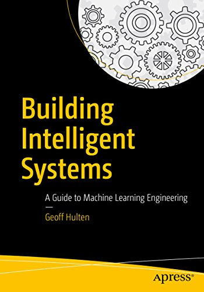
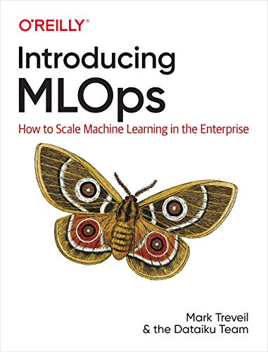
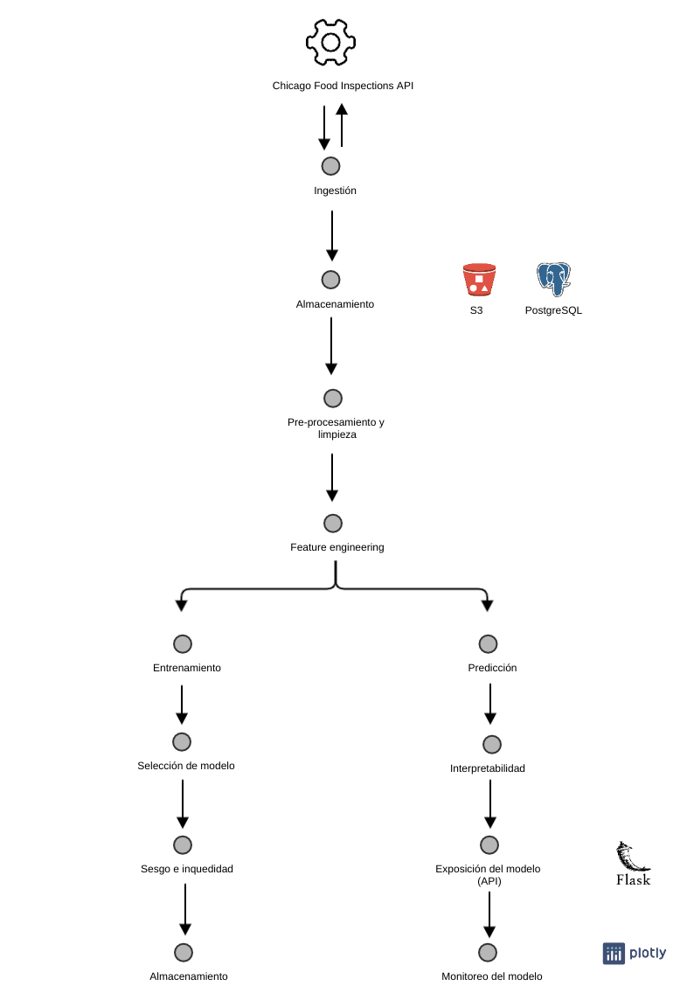

M. Sc. Liliana Millán Núñez liliana.millan@itam.mx

Enero 2021

# Arquitectura de Productos de Datos

Repositorio de la clase Arquitectura de Producto de Datos

## Descripción del curso

Este curso esta diseñado para que puedas desarrollar un producto de datos de inicio a fin. Esto implica conocer todas las partes que están involucradas en un producto de datos, así como el desarrollo de muchas pequeñas piezas que hacen un todo.

### Objetivos

+ Que conozcas los diferentes elementos que forman parte de un producto de datos.
+ Que conozcas las implicaciones de cada uno de esos elementos.
+ Que entiendas conceptos básicos de ingeniería de software/ingeniería de datos.
+ Que puedas construir productos de datos de inicio a fin.
+ Que seas capaz de levantar infraestructura en la nube (AWS).

## Prerequisitos

+ Github
+ Python
+ Docker\*
+ SQL
+ Cuenta en AWS Education (o no)
+ Trabajo en equipo

\* Deseable.

## Material del curso

El diseño de los temas, el contenido y las lecturas fueron hecho con base en la clase [*Software Engineering for AI-Enabled Systems*](https://ckaestne.github.io/seai/) de **Kristian Kaestner** y **Eunsuk Kang** impartida en *Carnegie Mellon Universty* a finales de 2019, así como por adecuaciones realizadas junto con el Dr Adolfo de Unánue.

+ Libro [Building Intelligent Systems: A Guide to Machine Learning Engineering](https://www.amazon.com.mx/Building-Intelligent-Systems-Learning-Engineering-ebook/dp/B07B91WQHR/ref=sr_1_1?__mk_es_MX=%C3%85M%C3%85%C5%BD%C3%95%C3%91&keywords=building+intelligent+systems&qid=1579111267&sr=8-1) de **Geoff Hulten**.

+ Libro [Introducing MLOps](https://www.amazon.com.mx/Introducing-MLOps-Machine-Learning-Enterprise-ebook/dp/B08PDW3JLY/ref=sr_1_1?__mk_es_MX=%C3%85M%C3%85%C5%BD%C3%95%C3%91&dchild=1&keywords=mlops&qid=1610337923&sr=8-1)

## Evaluación

+ *Checkpoints* 80%:
  + Funcional: 10
  + Con errores o incompleto: 5
  + No se hizo: 0
+ Proyecto funcional: 20%
  + Tu proyecto es una entrega de un producto de datos, incluye un `README.md`, tiene `requirements.txt`.

## Políticas del curso

+ Nuestro principal medio de comunicación es [Slack](https://slack.com/intl/es-mx/), lo puedes instalar en tu computadora y en tu celular.
  + Nuestro *workspace* se llama `dpa_primavera_21`, puedes integrarte al grupo a través de esta [liga](https://join.slack.com/t/dpaprimavera21/shared_invite/zt-krewnpn8-POOJrJRRhlAofWzhyiZ3uA).
  + Por favor agrega a tu perfil el nombre con el que quieres que te llamemos en la clase y una foto para saber quién eres
+ Las notas se encuentran en Github en `https://github.com/ITAM-DS/data-product-architecture` **en la rama** `dpa_2021`.
+ Nos moveremos a Zoom en lugar de Teams utilizando siempre la siguiente [liga](https://itam.zoom.us/j/91296837188?pwd=RFhYSlVBOS9ZcXprc1U4VWNkaGdKdz09).
+ Ocuparemos un documento conjunto en donde haremos la recopilación de preguntas que vayan surgiendo [aquí](https://docs.google.com/document/d/1O6rYP4ln_nz4cMSJ5YdJAT5AyohmdvaQhn-jfxp6_VE/edit?usp=sharing)
+ Si por cualquier cosa necesitas enviar un correo por favor que tu *subject* sea `dpa_itam_2021`, de otra manera se pierde en mi spam :(

  Para tener acceso a las notas del curso necesitas tener una cuenta en Github, si aún no tienes una puedes crear una [aquí](https://github.com/) y enviarme **tu usuario** o **correo** que registraste en github a través de Slack por mensaje directo.

## Cursos recomendados

+ Aprendizaje de máquina
+ Progamación para DS

## Complementos a esta clase

+ Optativa de Proyectos de Ciencia de Datos de Política Pública
+ Introducción a Ciencia de Datos

## Master plan

### Tecnologías/Frameworks/Servicios a ocupar

+ [Luigi](https://luigi.readthedocs.io/en/stable/): Orquestador de *jobs*
+ Python: Lenguaje de programacion general
+ Pandas/[Koalas](https://docs.databricks.com/languages/koalas.html)/[PySpark](https://spark.apache.org/docs/latest/api/python/index.html): Procesamiento de datos
+ [Marbles](https://github.com/twosigma/marbles): Pruebas unitarias a datos
+ [S3](https://aws.amazon.com/es/s3/): Servicio de alamacenamiento de AWS
+ [PostgreSQL](https://www.postgresql.org/): Base de datos
+ [Sklearn](https://scikit-learn.org/stable/modules/classes.html)/[MLlib](https://spark.apache.org/docs/latest/ml-guide.html) (Spark): *Machine learning*
+ [Zeppelin](https://zeppelin.apache.org/): Notebooks en la nube
+ [Flask](https://flask.palletsprojects.com/en/1.1.x/): Desarrollo de API REST
+ [Dash Plotly](https://plotly.com/dash/): *Dashboards*

### Checkpoints

+ Checkpoint 1: *Starting point*
+ Checkpoint 2: Ingestión y almacenamiento
+ Checkpoint 3: Pre-procesamiento y limpieza
+ Checkpoint 4: *Feature engineering*
+ Checkpoint 5: Entrenamiento
+ Checkpoint 6: *Bias & Fairness*
+ Checkpoint 7: Predicción
+ Checkpoint 8: Interpretabilidad
+ Checkpoint 9: API
+ Checkpoint 10: *Dashboard*

### Base de datos

+ [Chicago Food Inspections](https://www.chicago.gov/city/en/depts/cdph/provdrs/healthy_restaurants/svcs/restaurant_food_inspection.html)
+ Pregunta analítica: ¿El establecimiento pasará o no la inspección?

### Empieza con

+ [AWS Cloud Practitioner Essentials](https://aws.amazon.com/training/course-descriptions/cloud-practitioner-essentials/) -> Video de 6 horas para familiarizarte con conceptos de AWS.
