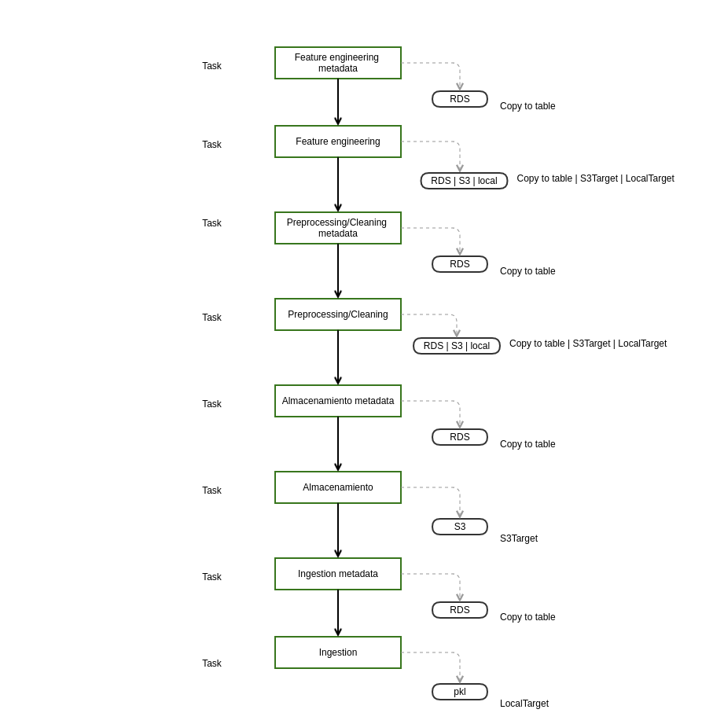

M. Sc. Liliana Millán Núñez liliana.millan@itam.mx

Abril 2021

### Checkpoint 4

**Objetivo:** Guardar metadata en RDS

¿Qué se entrega?

+ `README.md` actualizado
+ `requirements.txt` actualizado
+ Imagen de DAG en verde con las 8 tareas
+ DAG con todos los task en verde
+ Código

**Demo en clase**

1. Correr preprocesamiento y limpieza "nuevo" -> luigi corre
* Se muestra que se generan los metadatos de preprocesamiento y limpieza en la base de datos
* Se muestra la salida del preprocesamiento y limpieza (S3 o RDS)
* Mostrar DAG en verde
2. Correr preprocesamiento y limpieza "repetido" -> luigi no corre nada nuevo
* Se muestra que no se generaron los metadatos de preprocesamiento y limpieza en la base de datos
* Se muestra que no se genera nueva salida del preprocesamiento y limpieza (S3 o RDS)
3. Correr task de feature engineering (FE) "nuevo" -> luigi corre
* Se muestra que se generan los metadatos de FE en la base de datos
* Se muestra la salida del feature engineering (s3 o RDS)
* Se muestra DAG en verde
4. Correr task de feature engineering (FE) "repetido" -> luigi no corre nada nuevo
* Se muestra que no se generan los metadatos de FE en la base de datos
* Se muestra que no se genera nueva salida del FE (S3 o RDS)

**Fecha de entrega sugerida: 15 abril 2021**

#### ¡Ánimo!
