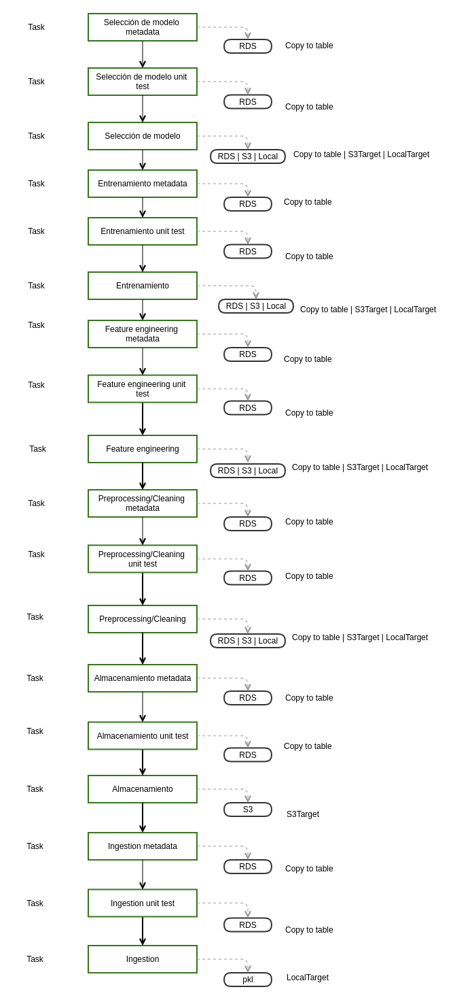

M. Sc. Liliana Millán Núñez liliana.millan@itam.mx

Abril 2021

### Checkpoint 5

**Entrega 27 de abril del 2021 23:59:59**

**Objetivos:**

+ Agregar pruebas unitarias a tus datos en cada punto de tu *pipeline*.
+ Agregar 2 nuevos tasks a tu pipeline para cubrir la parte de entrenamiento

¿Qué se entrega?

+ Actualización de tu `README.md`
  + Agregar tu DAG en verde completo
  + Incluye instrucciones de cómo correr tu luigi
+ Actualización de tu `requirements.txt`.
+ Si aún no lo tienes, sección de instalación de tu producto de datos: Qué pasos debo seguir para bajar tu producto y echarlo a andar.
+ Código

**Demo en clase**

Tienes de 5 a 7 minutos para presentar, **en tu EC2**:

1. Correr desde "entrenamiento metadata" -> luigi corre. Correr desde la sección de entrenamiento_metadata -> entrenamiento_pruebas_unitarias -> entrenamiento)
* Se muestra que la prueba unitaria pasa
* Se muestra la metadata generada en RDS
* Se muestra DAG en verde
2. Correr desde "entrenamiento metadata" mismos parámetros -> luigi no corre
* Se muestra la salida de luigi que todo está bien, pero no corrió nuevos tasks
3. Correr desde "entrenamiento metadata" nuevos parámateros -> luigi corre
* La prueba unitaria falla, se muestra mensaje de error con contexto
* Se muestra el DAG en rojo, no se corre metadata  
* Se muestra en RDS que la metadata no se generó
4. Correr desde "selección de modelo metadata" -> luigi corre. Correr desde la sección de "selección de modelo metadata" -> "selección de modelo unit test" -> "selección de modelo".
* Se muestra que la prueba unitaria pasa y la metadata se almacena en RDS
* Se muestra la metadata generada en RDS  
* Se muestra DAG en verde
5. Correr desde "selección de modelo metadata" mismos parámetros -> luigi no corre
* Se muestra la salida de luigi que todo está bien, pero no corrió nuevos tasks
6. Correr desde "selección de modelo metadata" nuevos parámetros -> luigi corre
* La prueba unitaria falla, se muestra mensaje de error asociado con contexto
* Se muestra el DAG en rojo, no se corre metadata
* Se muestra en RDS que la metadata no se generó
