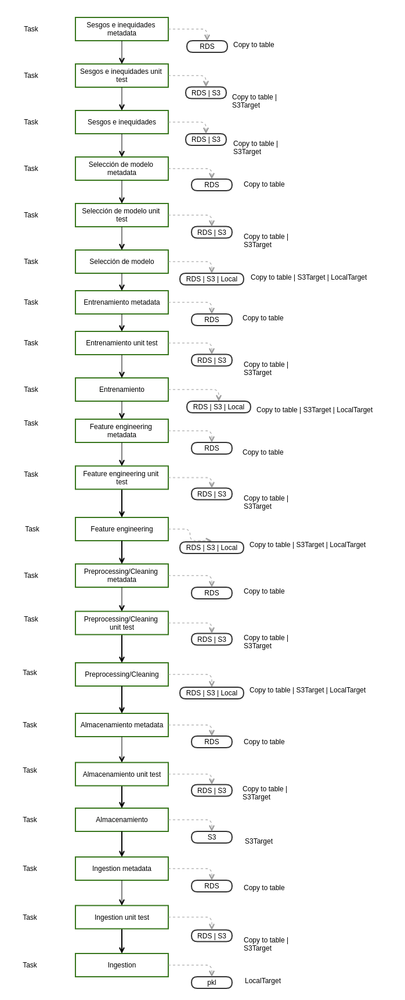

M. Sc. Liliana Millán Núñez liliana.millan@itam.mx

Abril 2021

### Checkpoint 6

**Objetivo:** Agregar funcionalidad de cuantificación de sesgos e inequidades al modelo seleccionado.

* Se agregan al pipeline de entrenamiento 3 tasks:
  + Cuantificacion de sesgos e inequidades
  + Prueba unitaria de sesgos e inequidades
  + Metadata de sesgos e inequidades.

¿Qué es entrega?

+ `README.md` actualizado con las instrucciones necesarias para correr todo su *pipeline*.
+ Código actualizado.
+ DAG en verde actualizado.
+ ¿Cuáles son los atributos protegidos?
+ ¿Qué grupos de referencia tiene cada atributo protegido?, explica el por qué
+ ¿Tu modelo es punitivo o asistivo? explica por qué
+ ¿Qué métricas cuantificarás ocuparás en sesgo e inequidad? explica por qué

#### Demo

Tienes 5 minutos para mostrar:

+ Se corre la tarea de "sesgos metadata" nueva.
    + Luigi corre
    + Se corre el task "sesgos e inequidades" que genera la tabla de métricas de sesgos e inequidades y se almacena en RDS o en S3
    + Se corre el task "sesgos unit test", la prueba pasa, se almacena su salida en S3 o RDS.
    + Se guarda la metadata asociada al task en RDS.
+ Se corre la tarea de "sesgos metadata" mismos parámetros.
   + Luigi no corre
   + No se genera Metadata
   + No se genera salida de sesgos e inequidades
+ Se corre la tarea de "sesgos metadata" con prueba unitaria "mala".
   + La prueba unitaria truena, se muestra mensaje de contexto de Marbles
   + No se genera metadata
   + DAG en rojo
